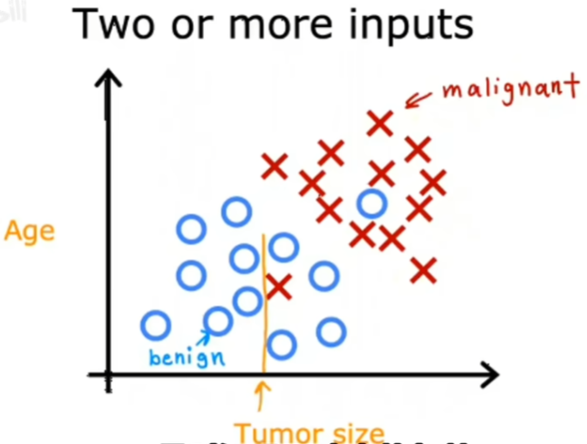

# 机器学习

<iframe src="//player.bilibili.com/player.html?isOutside=true&aid=113769053358965&bvid=BV1owrpYKEtP&cid=27694664301&p=1&autoplay=0" width="640" height="480" scrolling="no" border="0" frameborder="no" framespacing="0" allowfullscreen="true"></iframe>

## 简介

### 监督学习

```
定义
x -> y
依靠给定x y进行学习，试图得到映射关系，并对未见过的数据进行预测输出结果
```

#### 回归

定义：从无数数据中学习预测一个数字，本质是预测映射函数


#### 分类

可以理解成数字量（离散的有限的）

定义：预测种类



一般来说，输入量的种类越多，识别的就越精确


### 无监督学习

#### 聚类

 获取没有标签的数据并尝试自动将其分组到集群中


## 线性回归模型

### 监督模型


## 代价函数

代价函数(Cost Function)

平方误差代价函数应用最广


cost function最小解


## 梯度下降

$\alpha$ : learning rate

w、b同时更新


梯度下降的作用原理


## 向量化

