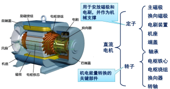
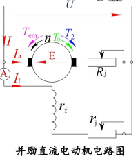
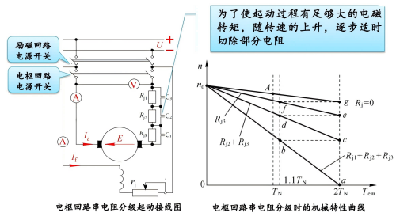
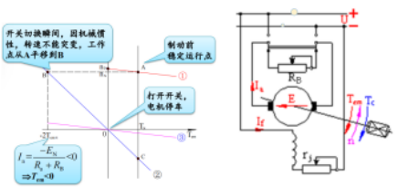
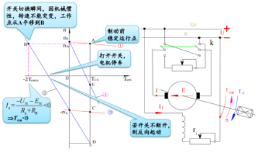
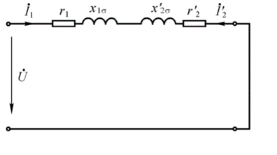
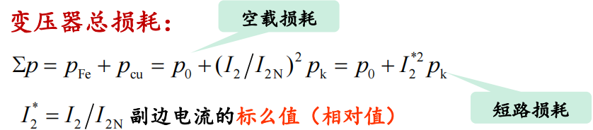

# 电气控制技术

???+note "课程资源"

    === "作业资源"
       [浙大b站网课](https://www.bilibili.com/video/BV1m54y1k7Vg/?spm_id_from=333.999.0.0&vd_source=ace17a48ec1787387c4c8d582e6808cb) 
       [电机学](https://www.bilibili.com/video/BV1QG411y7vG/?spm_id_from=333.999.0.0) 
       [电力电子系统(个人觉得讲的非常好)](https://www.bilibili.com/video/BV1eA411z7ET/?spm_id_from=333.999.0.0) 
    
    === "实验资料"
       [直流电机实验](https://wenku.baidu.com/view/e366a1c04028915f804dc25b?aggId=e366a1c04028915f804dc25b&fr=catalogMain_&_wkts_=1728694474010) 
       [三相异步电机的起动和调速](https://wenku.baidu.com/view/df818e06a417866fb94a8e25?aggId=df818e06a417866fb94a8e25&fr=catalogMain_&_wkts_=1729229854818) 
       [双闭环晶闸管不可逆直流调速系统实验](https://wenku.baidu.com/view/8f56a36e25c52cc58bd6be37?aggId=7d26c88652ea551810a687c4&fr=catalogMain_text_ernie_recall_v1%3Awk_recommend_main1&_wkts_=1730172744501) 

​       

## 电机学

### 直流电动机

基本结构：定子 转子

- 注：换向器相邻两片之间相互绝缘

#### 电枢绕组

- 电枢绕组：转子上的线圈（叠绕组、波绕组、蛙形绕组）

- 绕组元件：两端出线分别和两片换向片 联接的单匝或多匝线圈

- 实槽数：电枢表面所开的嵌线槽，用 Z 表示

- 虚槽数：$Z_i$ = μZ 同一个槽内放置μ元件

  

- 元件数S、换向片数K和虚槽数$Z_i$相等

##### 叠绕组

- 适用于高电流
- 

- 单叠绕组的并联支路对数a和主磁极极对数p相等

- 电枢电流：$I_a = 2ai_a,其中i_a为每条支路的电流$

##### 波绕组

- 高电压（每条支路上电阻多）
- 

- 单波绕组的并联支路对数a=1
- 电枢电流：$I_a = 2ai_a,其中i_a为每条支路的电流$

#### 励磁方式

励磁方式是指**励磁绕组**中励磁电流的获得方式

一共有两套绕组：励磁绕组和电枢绕组

可以理解为电枢绕组先通电，然后通过以下几种方式使得励磁绕组获得励磁电流

复励分为长复励与短复励：

- 长复励：串励电阻与电枢串后再与并励电阻并
- 短复励：电枢与并励电阻并后再与串励电阻串

#### 直流电动机额定值

- 额定功率 $P_N$
- 额定电压 $U_N$ 
- 额定电流 $I_N$
- 额定转速 $n_N$
- 额定效率 $\eta_N$ 

 $P_N = U_N I_N \eta_N$

额定功率是指电动机的输出功率

#### 基本工作原理

换向器与电刷的共同作用使得外加直流，到电枢内部就变成了交流的形式，实现了持续旋转

##### 感应电动势

$每根导体感应的平均电动势: \quad e_{av} =B_{av}lv \\$
$导体切割磁场线的线速度: \quad v=\frac{2\pi R}{60}n = \frac{2p\tau}{60}n \\$
$电枢绕组感应电动势: \quad E = \frac{N}{2a}\frac{\Phi}{l\tau}l\frac{2p\tau n}{60} = \frac{pN}{60a}\Phi n = C_e \Phi n \\$
$其中C_e = \frac{pN}{60a}称为电动势常数$

##### 电磁转矩

$T_{em}=NB_{av}li_a \frac{D_a}{2}\\$
$T_{em} = N\frac{\Phi}{l\tau}l\frac{I_a}{2a}\frac{2p\tau}{2\pi}=\frac{pN}{2\pi a}\Phi I_a=C_T \Phi I_a\\$
$C_T=\frac{pN}{2\pi a} 称为转矩常数$

其中$C_T/C_e = 60/2\pi = 9.55$

#### 并励直流电动机的机械特性

##### 电路图

##### 基本方程

**1.电动势平衡方程**

$U = E+I_a(R_a+R_j)\\$
$U=I_f(r_f+r_j)=I_fR_f$

转速公式

$由E=C_e\Phi n得： n = \frac{U-I_a(R_a+R_j)}{C_e \Phi}\\$

**2.转矩平衡方程**

稳定运行时：$T_{em} =T_2+T_0 = T_c$
- $T_c$为总负载转矩,$T_2$为输出转矩 ,$T_0$为空载转矩

变速过程:$T_{em} =T_2+T_0 + J\frac{d \Omega}{dt} = T_c +\frac{GD^2 dn}{375dt}$
- J为转动惯量，$GD^2$为飞轮距

**3.功率平衡方程**

输入功率：$P_1 = UI = U(I_a +I_f)$

当电枢回路不串外接电阻$R_j$时：$P_1 = (E + I_a R_a) I_a + U I_f = E I_a + I_a^2 R_a + U I_f = P_{em} + p_{cua} + p_{cuf}$

- 其中，$P_{em}为电磁功率，p_{cua}为电枢回路总损耗，p_{cuf}为励磁回路总损耗$

电动机的电磁功率：

$P_{em} = E I_a = T_{em} \Omega = \left(T_2 + T_0\right) \Omega = P_2 + p_0$

- 其中$P_2为输出机械功率，p_0为空载损耗$

$p_0 = p_{Fe} + p_{mec} + p_{ad}$

- 其中$p_{Fe}为机械损耗，p_{ad}为附加损耗$

$P_1 = p_{\text{cuf}} + p_{\text{cua}} + p_{Fe} + p_{\text{mec}} + p_{\text{ad}} + P_2 = \sum p + P_2$

- 其中$P_2 = P_N$

#### 机械特性

机械特性一般表达式：$n = \frac{U}{C_e \Phi} - \frac{R_a + R_j}{C_e \Phi} I_a = \frac{U}{C_e \Phi} - \frac{R_a + R_j}{C_e C_T \Phi^2} T_{em}$

##### 并励直流电动机的自然机械特性

$n = \frac{U}{C_e \Phi_N} - \frac{R_a + R_j}{C_e \Phi_N} I_a = \frac{U}{C_e \Phi_N} - \frac{R_a + R_j}{C_e C_T \Phi_N^2} T_{em} = n_0 - \beta_N T_{em}$

$其中，\Phi_N:额定运行下的每极有效磁通 \quad n_0:额定电压、额定励磁时所对应的理想空载转速  $

$ \beta_N:自然机械特性的斜率 $

**额定负载时转速降越小越好**

##### 并励直流电动机的人为机械特性

**①改变电枢回路外接电阻$R_j$的人为机械特性**

$n = \frac{U_N}{C_e \Phi_N} - \frac{R_a + R_j}{C_e C_T \Phi_N^2} T_{em} = n_0 - \beta T_{em}$

$R_j$越大，斜率也就越大

**②改变电枢端U的人为机械特性**

$n = \frac{U}{C_e \Phi_N} - \frac{R_a}{C_e C_T \Phi_N^2} T_{em} = n_0' - \beta_N T_{em}$

实际上改变的是空载转速$n_0$

**③减弱主磁通Φ的人为机械特性(即增大励磁回路外接电阻$r_j$)**

$n = \frac{U_N}{C_e \Phi} - \frac{R_a}{C_e C_T \Phi^2} T_{em} = n_0'' - \beta' T_{em}$

#### 直流电动机的启动、制动与调速

##### 起动

存在问题：启动时，n与E均为0,$I_a = \frac{U_N - E}{R_a}$为额定电流的十几倍以上。

要求：控制起动电流为额定电流的1.5~2倍

解决方法：

- 降低电枢端电压起动

起动电压很低，随着n的升高，U也增加

- 电枢回路串电阻起动

$I_{st}=I_a = \frac{U_N}{R_a +R_j}$

随着转速的上升，逐步减小$R_j$的阻值，实现从$a->b->c->e->f->g->A$的目标

##### 调速

- 改变电枢端电压调速（降压调速）

- 改变串入电枢回路电阻调速

-  改变励磁电流调速（弱磁调速）

不适合恒转矩负载，因为电流会变大，电动机会过热

##### 制动

- 能耗制动

准备制动时，如右图所示，电源断开，不再进行供电，此时$n = -\frac{R_a+R_B}{C_e C_T \Phi_N^2}T_{em}$,因此从线①的A点变到线②的B点，一般来说需要串联电阻$R_B$来保护电流，因此从线①的A点变到线③。

- 反接制动
- ① 电压反向的反接制动

准备制动时，电源电动势反向，此时$n = \frac{-U_N}{C_e\Phi_N}-\frac{R_a+R_B}{C_e C_T \Phi_N^2}T_{em}$,因此，从图中的①线的A点变为②线的B点

- ② 电势反向的反接制动

上图中，对于位能性负载，即力矩不发生变化，因此会从线①的A点慢慢变到线②的D点，中间有一时刻转速为0。

- 回馈制动

### 变压器

#### 分类

- 相数：单相、三相
- 绕组：双绕组、三绕组、多绕组、自耦
- 冷却方式：油浸式、干式
- 铁心结构 ：芯式、壳式

#### 基本结构（非重点）

结构：铁心；高、低压两套绕组

铁芯：叠片式、渐开线式
- 其中，叠片式又分芯式和壳式

#### 额定值

额定容量：$S_N$（视在功率VA）
- **原边、副边的额定容量相等**

额定电压：原边$U_{1N}$,副边$U_{2N}$
- **副边额定电压$U_{2N}$是变压器原边外加额定电压$U_{1N}$时副边的空载电压**
- **三相变压器，额定电压指线电压**

额定电流：原边$I_{1N}$,副边$I_{2N}$
- **单相变压器：** $I_{1N} = \frac{S_N}{U_{1N}}  \quad I_{2N} = \frac{S_N}{U_{2N}}$
- **三相变压器：** $I_{1N} = \frac{S_N}{\sqrt{3}U_{1N}} \quad I_{2N} = \frac{S_N}{\sqrt{3}U_{2N}}$

额定频率：**$f_N = 50Hz$**

#### 基本工作原理

- 若磁通按正弦规律变化，即 $\Phi = \Phi_msin\omega t \quad e_1 = -w_1 \omega \Phi_m cos\omega t = 2 \pi fw_1 \Phi_m sin(\omega t -90^0)$
- 用向量表示有 $\dot{E_1}  = -j\sqrt{2}\pi fw_1 \dot{ \Phi}_m = -j4.44 fw_1 \dot{ \Phi}_m$
- 同理有 $\dot{E_2}  = -j \sqrt{2}\pi fw_2 \dot{ \Phi}_m= -j 4.44 fw_2 \dot{ \Phi}_m$
- 变压器变比$k = \frac{E_1}{E_2}=\frac{w_1}{w_2} \simeq  \frac{U_{1N}}{U_{2N}}$
- $w_1与w_2为匝数$

##### U和E正方向的判定

[视频：变压器U&E方向标注](https://www.bilibili.com/video/BV1bj411x7VN/?spm_id_from=333.337.search-card.all.click&vd_source=ace17a48ec1787387c4c8d582e6808cb)

首先考虑一个简单的通电螺线管，将通电的螺线管看作一个电源，电源内部电流从负极流向正级，因此E和U的方向如下图所示

原边的方向与上述通电螺线管判断一致。再根据右手定则判断磁通的方向，如图$\phi$所示，再根据右手螺旋定则判断副边电流$i_2$的方向，再根据上面的方法判断E和U的方向,$U_2$由于是负载端，因此$U_2$的方向与电流方向保持一致。

##### 单相变压器空载运行

原边等效电路

- 原边电动势平衡方程式

$u_1 = -e_1 - e_{1\sigma} + i_0 r_1$

$\dot{U}_1 = -\dot{E}_1 - \dot{E}_{1\sigma} + \dot{I}_0 r_1= -\dot{E}_1 + j\dot{I}_0 x_{1\sigma} + \dot{I}_0 r_1= -\dot{E}_1 + \dot{I}_0 Z_1$

- 副边电动势平衡方程式

$u_2=e_2$

$\dot{U}_2 = \dot{E}_x$

##### 单相变压器负载运行

- 磁动势平衡方程

$\dot{F}_1=\dot{I}_1 w_1$

$\dot{F}_2=\dot{I}_2 w_2$

$\dot{F}_1 +\dot{F}_2 =\dot{F}_m=\dot{I}_m w_1$

- 励磁电流

$\dot{I}_m = \dot{I}_1+ \frac{w_2}{w_1}\dot{I}_2$

- 电动势平衡方程式

$\dot{U}_1 = -\dot{E}_1 - \dot{E}_{1\sigma} + \dot{I}_1 r_1= -\dot{E}_1 + j\dot{I}_1 x_{1\sigma} + \dot{I}_1 r_1= -\dot{E}_1 + \dot{I}_1 Z_1$

$\dot{U}_2 = \dot{E}_2 + \dot{E}_{2\sigma} - \dot{I}_2 r_2= \dot{E}_2 - j\dot{I}_2 x_{2\sigma} - \dot{I}_2 r_2= \dot{E}_2 + \dot{I}_2 Z_2$

##### 折算

用一个匝数和原边线圈相等的新的副边线圈来替代实际的副边线圈

折算方法：

- 电动势/电压的折算值——原值乘以k
- 电流的折算值——原值除以k
- 阻抗的折算值——原值乘以$k^2$

折算后的基本方程式
$$
\dot{U}_{1} = -\dot{E}_{1} + \dot{I}_{1} r_{1} + j \dot{I}_{1} x_{1\sigma} \\
\dot{U}_{2}^{\prime} = \dot{E}_{2}^{\prime} - \dot{I}_{2}^{\prime} r_{2}^{\prime} - j \dot{I}_{2}^{\prime} x_{2\sigma}^{\prime} \\
\dot{U}_{2}^{\prime} = \dot{I}_{2}^{\prime} Z_{L}^{\prime} = \dot{I}_{2}^{\prime} \left(R_{L}^{\prime} + j x_{L}^{\prime}\right) \\
\dot{I}_{1} + \dot{I}_{2}^{\prime} = \dot{I}_{m} \\
\dot{E}_{1} = \dot{E}_{2}^{\prime} = -j 4.44 f w_{1} \dot{\Phi}_{m} \\
\dot{E}_{1} = \dot{E}_{2}^{\prime} = -\dot{I}_{m} Z_{m} = -\dot{I}_{m} \left(r_{m} + j x_{m}\right)
$$
变压器等效电路图如下图所示

#### 参数测定

##### 空载实验

!!! note "一般在低压侧加额定电压"
	低压变做空载实验时电压较低，电流较大，有利于实验安全和仪器选择 
	

降压变压器：在副边进行空载实验

升压变压器：在原边进行空载实验

由于$Z_m远大于Z_1$，因此认为$U_1$与$E_1$值相等

以降压变压器为例子
$$
z_{2~m} = \frac{U_0}{I_0} \\

r_{2~m} = \frac{p_0}{I_0^2} \\

x_{2~m} = \sqrt{z_{2~m}^2 - r_{2~m}^2}
$$
三式联立求解，最后则算到原边
$$
z_m = k^2 z_{2~m} \\
r_m = k^2 r_{2~m} \\
x_m = k^2 x_{2~m}
$$

##### 负载实验

以降压变压器为例子
$$
Z_k = U_k/I_k \\
r_k = p_k/I_k^2\\
x_k = \sqrt{z_k^2-r_k^2}
$$

#### 外特性与电压变化率

##### 外特性

$U_1 = U_{1N},cos\phi_2=常数时，U_2=f(I_2)$的关系曲线称为变压器的外特性

##### 电压变化率（电压调整率）

#### 损耗与效率

基本铜耗：原、副边绕组中电流引起的电阻损耗

附加铜耗：导体在交变漏磁场作用下引起集肤效应，有效电阻增大而增加的铜耗

基本铁耗：铁心中的磁滞和涡流损耗

附加铁耗：结构件中的涡流损耗

### 异步电机

#### 异步电动机结构和额定值

##### 结构

鼠笼式和绕线式

##### 额定值

- 额定功率 $P_N$
- 额定电压 $U_N$ （线电压）
- 额定电流 $I_N$（线电流）
- 额定转速 $n_N$
- 额定效率 $\eta_N$ 

 $P_N = \sqrt{3} U_N I_N cos\phi_N \eta_N$

##### 各种参数

槽距角

极距

每级每相槽数

