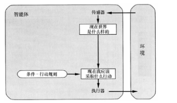
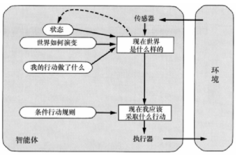
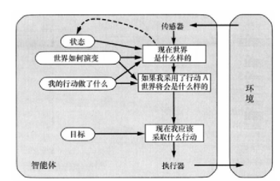
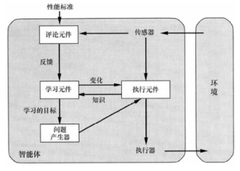
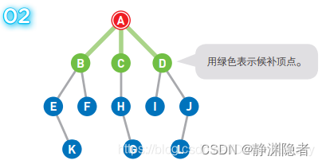
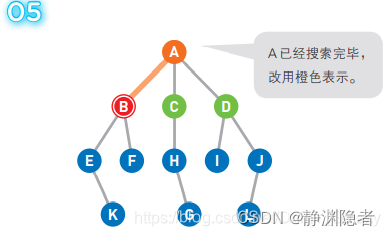
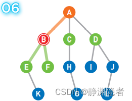
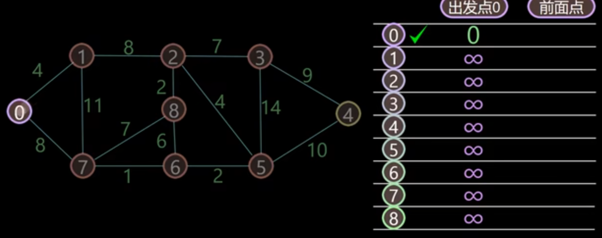

# 人工智能与机器学习

???+note "课程资源"

    === "作业资源"
       看到是国科大的作业<br>
       [作业](https://wenku.baidu.com/view/a008b8323a3567ec102de2bd960590c69ec3d8e1.html?_wkts_=1727330708826&needWelcomeRecommand=1)<br>
       [第二章作业](https://blog.csdn.net/m0_67495624/article/details/135541806)<br>
       [小测1](https://www.cc98.org/topic/5795381)<br>
       [小测2](https://www.cc98.org/topic/6006987)<br>
    
    === "分数构成"
        15% 随堂测试<br>
        20% 实验报告<br>
        5% 考勤<br>
        8% 课后作业<br>
        12% 小组大作业<br>
        40% 闭卷考试<br>
        
    === "历年小测"
        [第一次小测](../class_source/C_M01/1.pdf)<br>
        [第二次小测](../class_source/C_M01/2.pdf)<br>
        [第三次小测](../class_source/C_M01/3.pdf)<br>
        [第四次小测](../class_source/C_M01/4.pdf)<br>
        [第五次小测](../class_source/C_M01/5.pdf)<br>
        [第六次小测](../class_source/C_M01/6.pdf)<br>
    
    === "回忆卷"   
        [23-24回忆卷(机器人)](https://www.cc98.org/topic/5875948)<br>
        [23-24回忆卷(机器人)](https://www.cc98.org/topic/5875928)<br>
        [23-24回忆卷(自动化)](https://www.cc98.org/topic/5796633)<br>
        [23-24回忆卷(自动化)](https://www.cc98.org/topic/5796623)<br>
        [22-23回忆卷(机器人)](https://www.cc98.org/topic/5586258)<br>
        [22-23回忆卷(自动化)](https://www.cc98.org/topic/5532570)<br>
        [22-23回忆卷(自动化)](https://www.cc98.org/topic/5508902)<br>
    
    === "学习资料"
        [考试题库1](https://blog.csdn.net/qq_44528283/article/details/114399093)<br>
        [考试题库2](https://www.pudn.com/news/6277cf47d7996104df504792.html)<br>
        [归结原理证明题](https://www.bilibili.com/video/BV1sa4y1B7Eq?spm_id_from=333.788.videopod.sections&vd_source=ace17a48ec1787387c4c8d582e6808cb)<br> 
        [归结原理讲解](https://www.bilibili.com/video/BV1Uv41117Rb/?spm_id_from=333.337.search-card.all.click&vd_source=ace17a48ec1787387c4c8d582e6808cb)<br>
        [ID3算法讲解](https://www.bilibili.com/video/BV1Cq4y1S7k1/?spm_id_from=333.337.search-card.all.click&vd_source=ace17a48ec1787387c4c8d582e6808cb)<br>

!!! Abstract "下面课程内容是基于98的资料，少做修改，原文请参考[98链接](https://www.cc98.org/topic/5533160)，帅气的RQY"


## 人工智能

###  绪论

#### 定义

**人工智能概念的一般描述**：Artificial Intelligence，目前是指用**计算机模拟或实现的智能**， 研究如何在机器上实现**人类智能**。即用机器来模仿人的智能。因此人工智能**又称机器智能**

**智能**：辨识区分事物从而做出正确选择的能力（智能=知识+思维）

**人类的自然智能**：指人在认识客观世界的过程中，由**思维过程和脑力活动**所表现出来的综合能力，如感知观察能力、记忆能力、逻辑思维能力和语言表达能力等

**智能包含的能力**

- 感知能力
- 记忆和思维能力
- 学习和自适应能力
- 行为能力	<br>
$\quad$1.含义：是人们对感知到的外界信息作出动作反应的能力<br>
$\quad$2.信息来源：由感知直接获得的外界信息经过思维加工后的信息。

**人工智能的简单模型**


**详细定义**：人工智能是研究人类智能活动的规律，构造具有一定智能的**人工系统**，研究如何让**计算机**去完成以往需要人的智力才能胜任的工作，也就是研究如何应用计算机的软硬件来模拟人类某些智能行为的基本理论、方法和技术。

**组织成四类的人工智能的若干定义**：


**图灵测试**：让一台计算机和测试者分开，通过键盘等装置实现询问，如果一台计算机能够让30%的人误以为它是人而不是计算机，那么就通过了图灵测试。

**为了设计能够通过图灵测试的机器，需要用到哪些人工智能技术？**

1. 计算机视觉技术：精确地完成各种自动识别
2. 机器学习技术：从大量数据中自动提炼知识、发现规律
3. 自然语言处理技术：赋予计算机人类般的文本处理能力
4. 语音识别技术：自动而准确地将人类的语音转变成文字

**人工智能的基础**：

- 哲学：标出了AI的大部分重要思想；
- 数学：使AI成为一门规范科学；
- 经济学：决策理论；
- 神经科学：网络，并行处理；
- 心理学：认知理论；
- 计算机工程：AI的“载体”；
- 控制论：反馈的思想；
- 语言学：知识表示、语法

**二十一世纪三大尖端技术**：人工智能、基因工程、纳米科学

★★★**人工智能的历史**


★★★**人工智能学派**：

- 符号学派：认为人的认知基元是符号，而且认知过程即符号操作过程。知识是信息的一种形式，是构成智能的基础人工智能的核心问题是知识表示、知识推理和知识运用
- 连接学派：认为人的思维基元是神经元
- 行为学派：认为智能取决于感知和行动，智能行为只能在现实世界中与周围环境交互作用而表现出来

**人工智能的目标**：近期目标：制造智能机器；长期目标：实现机器智能

**人工智能的三个阶段**：

1. 能存会算的计算智能
2. 能听会说、能看会认的感知智能
3. 能理解会思考的认知智能

**人工智能、机器学习、深度学习的关系**：机器学习是一种实现人工智能的方法，深度学习是一种实现机器学习的技术


**人工智能的研究内容**：知识表示、自动推理和搜索算法、机器学习和知识获取、知识处理系统、自然语言理解、计算机视觉、智能机器人、自动程序设计等

**人工智能的主要应用领域**：专家系统、机器人、模式识别、计算机视觉、人工神经网络、自然语言理解、自动程序设计、博弈等

**涉及学科：**除了计算机科学以外，人工智能还涉及信息论、控制论、自动化、仿生学、生物学、心理学、数理逻辑、语言学、医学和哲学等多门学科。


### 智能AGENT

#### AGENT的本质

##### 基本定义

智能体（Agent）：能够感知和动作的实体（任何独立的能够“思想”并可以同环境交互的实体都可以抽象为智能体）


简单说，一个智能体就是从**感知序列到动作**的一个函数： $f:P^* -> A$

- 感知信息：表示任何时刻Agent的感知输入。感

- 知序列：Agent收到的所有输入数据的完整历史。<br>
  $\quad$Agent在任何时刻的行动选择，取决于到该时刻为止的整个感知序列。<br>

- Agent函数：将任意给定感知序列映射到Agent的动作。可以描述Agent的行为。

##### Agent函数与Agent程序

- Agent函数：是一个抽象的数学表示
- Agent程序： 是Agent函数在某种物理体系上的具体实现

**Example**


- 世界：方格A和B
- 感知：可以感知所处的方格（位置）、是否有灰尘（本地的状态）如：[A, Dirty]
- 动作：向左移动、向右移动、吸取灰尘、什么也不做	Left, Right, Suck, NoOp
- Agent函数（感知-动作映射函数）：如果当前地点有灰尘，则吸取。否则移动到另一地点。

| **感知序列** | **行动** |
| :----------: | :------: |
|  [A, Clean]  |  Right   |
|  [A, Dirty]  |   Suck   |
|  [B, Clean]  |   Left   |
|  [B, Dirty]  |   Suck   |

#### 评价Agent的行为

- 理性Agent是做事正确的智能体。<br>
$\quad$1.即Agent函数表格的右边都填写正确。<br>
$\quad$2.严谨定义：对于每一个可能的**感知序列**，根据已知的**感知序列**和内建的**先验知识**，理性Agent选择能使**性能指标**的期望值**最大化的动作**。<br>

- 性能度量（Agent成功程度的标准）：通常由理性Agent的设计者给出，根据实际在所处的环境中希望得到的结果来设计度量，而不是根据智能体表现的行为。	<br>
$\quad$ 1.把Agent置于一个环境中后，它将针对收到的感知信息产生动作序列。	<br>
$\quad$ 2.该动作序列引起环境历经一个状态序列。	<br>
$\quad$ 3.如果环境的上述状态序列是想要的，则Agent的性能良好。<br>

- 理性的衡量依据：PEAS<br>
$\quad$ 1.性能度量——performance<br>
$\quad$ 2.agent对环境的先验知识——environment<br>
$\quad$ 3. agent可以执⾏的动作——actions<br>
$\quad$ 4.agent的感知序列——sensor<br>

- 理性不完美，理性不全知
- 理性智能体要会“学习”
- 理性智能体要有“自主性”

#### 任务环境

##### 性质

- 完全可观察与部分可观察<br>
$\quad$ 1.完全可观察：智能体能获取环境的完整状态，智能体不需要内部维护来记录世界的状况
- 确定性与随机<br>
$\quad$ 2.确定性：环境的下一个状态完全取决于当前状态和智能体的行动<br>
$\quad$ 3. 环境是确定的，除非有其它智能体活动的影响。<br>
- 片段式与延续式：行动的选择是否取决于当前片段
- 静态与动态<br>
$\quad$ 1.环境在智能体思考的时候是否会变化<br>
$\quad$ 2.出租车驾驶是动态的；纵横字谜游戏是静态的<br>
$\quad$ 3.半动态：环境本身不随时间的流逝而变化，但智能体的性能评价随时间变化；例如计时棋赛。<br>
- 离散与连续：智能体感知的信息和行动
- 单智能体与多智能体

**真实的世界**是部分可观，随机的，延续式的，动态的，连续的，多智能体的。

问题求解的环境是完全可观的，确定的，静态的，离散的。


#### Agent的结构

智能体 = 体系结构 + 程序

- AI的任务是设计智能体**程序**，实现把感知信息映射到行动的智能体**函数f**
- 体系结构为程序提供：<br>
$\quad$ 1.来自传感器的感知信息<br>
$\quad$ 2.运行程序<br>
$\quad$ 3.把程序产生的行动送到执行器 <br>
- 所选择的程序必须适合体系结构

???+note "判断题"
    === "每个Agent函数都可以由机器/程序组合呈现"
	False。受机器的运算能力和存储能力限制。<br>
	=== "一个Agent函数可能对应多个Agent程序"
	True。Agent程序与运行平台关联<br>
	=== "实现给定Agent函数的Agent程序是否可以有多个"
	True。比如添加一些代理程序，只输入不会影响输出的空值。<br>
	=== "给定一个固定的机器结构，任意agent程序都会精确执行一个agent函数吗？"
	True。agent的行为被结构和程序固定。<br>
	
!!! note "设想我们现在保持agent程序固定，但是我们加快机器运行速度为两倍，会影响agent函数吗？"
	答:这取决于程序和环境。 如果环境是动态的，则加快机器速度可能意味着选择不同（也许更好）的动作。 如果环境是静态的，并且程序不在意运行时间，agent函数保持不变。<br>
	
	

#### 智能体的（结构）类型

##### 分类

简单反射型：基于当前感知、忽略历史感知<br>

基于模型的简单反射型：使用内部模型记录世界的当前状态，按反射型决策<br>

基于目标型：追踪记录世界状态、要达到的目标，选择导致达成目标的行为<br>

基于效用型：使用更普适的度量：效用函数，把状态映射到实数来描述与智能体与状态相关的高兴程<br>


- 每种Agent程序都以特定的方式结合了特定的成分来生成行动
- 所有这些智能体都可以转变为学习智能体，能够提高性能以便生成更好的行动


##### 简单反射智能体

- 基于当前感知选择行动，忽略感知历史<br>
$\quad$ 1.基于当前感知选择行动，忽略感知历史<br>
$\quad$ 2.只有在可以仅根据当前感知信息来完成当前决策的情况下才能工作，即环境完全可观<br>



##### 具有模型的反射智能体

- 使用内部模型记录世界的当前状态，按反射型智能体方式选择行动



##### 基于目标的智能体

追踪记录世界的状态、要达到的目标，并选择导致达成目标的行动



##### 基于效用（utility）的智能体

使⽤更普适的度量：**效⽤函数**，把状态映射到实数来描述与智能体与状态相关的⾼兴程度

效用函数可以辅助进行决策：

- 有多个相互冲突的目标可达到时实现折中
- 多个目标都不能有把握达到时选择一个目标


##### 学习智能体

- 学习元件：负责改进，利用评论元件的反馈来评价智能体，并决定如何修改执行元件以将来做得更好
- 执行元件：负责选择外部动作，接受感知信息并进行行动决策
- 评论元件：根据固定的性能标准告诉学习元件智能体的运转情况如何
- 问题产生器：负责提议可以导致新的和有信息价值的经验的行动



Agent程序包含回答以下问题的部件：

- 当前状态；
- 当前应该采取的行动；
- 行动后果

**Agent**程序内部状态及其转换表示：

1. 原子表示：没有内部结构的表示
2. 要素化表示：一个状态中包含多个要素（原子），即多个变量和特征的集合
3.  结构化表示：一个状态包含对象、每个对象可能有自身的特征值，以及与其他对象的关系

智能体特性

- 自主性
- 反应性
- 适应性
- 社会性


#### 总结

- 定义：智能体是可以感知环境并在环境中行动的某种东西。智能体函数指定智能体响应任何感知序列所采取的行动。
- 性能度量评价智能体在环境中的行为表现。理性智能体的行动使其性能度量期望值最大化。
- 任务环境包括性能度量、外部环境、执行器和传感器。设计智能体的第一步总是把任务空间定义得尽可能完全。
- 任务环境的性质：变化的，完全可观察的？确定性的？片段式的？静态的？离散的？单智能体的？
- 智能体程序是智能体函数的实现
- 简单反射型智能体直接对感知信息作出反应
- 基于模型的反射智能体保持内部状态，追踪记录当前感知信息中不明显的世界信息。
- 基于目标的智能体的行动为了达到目标
- 基于效用的智能体试图最大化自己期望的“快乐”
- 所有智能体都可以通过学习来改进其性能

???+note "课后习题——给出任务环境的PEAS描述"

    === "机器人足球运动员"
    	表现度（Performance measure）： 胜利的标志，可能是进球的次数或比赛中采取的成功策略。<br>
    	环境（Environment）： 足球场地，包括球员、球、球场等。<br>
    	行动（Actuators）： 足球运动员可以执行的动作，如奔跑、传球、射门等。<br>
    	传感器（Sensors）： 用于感知球场状态、球的位置、其他球员的位置等信息<br>
    
    === "因特网购书智能体"
    	P:成功购买所需书籍的效率，可能包括花费的金钱、购书的时间等。<br>
    	E:因特网上的书店，包括书籍、价格、库存等信息。<br>
    	A:购买、搜索、添加到购物车等在线购书的动作。<br>
    	S:用于感知书店网站上的书籍信息、价格、用户的购物车状态等传感器。<br>
    	
    === "自主的火星漫游者"
    	P:成功执行任务的效率和准确性，例如探测到的有趣地点数量、完成的科学实验等。<br>
    	E:火星表面，包括地形、岩石、大气等。<br>
    	A:移动、采集样本、拍摄照片等火星漫游任务的动作。<br>
    	S:用于感知火星表面的传感器，包括摄像头、化学传感器、温度计等。<br>
    	
    === "数学家的定理证明助手"
    	P:成功证明定理的准确性和效率。<br>
    	E:数学定理的领域，可能包括公理、已知定理、未证明的定理等。<br>
    	A:推导、演绎、应用逻辑规则等进行定理证明的动作。<br>
    	S:用于感知数学领域的信息，包括公理、已知定理、证明中的中间步骤等传感器。<br>

### 通过搜索进行问题求解

#### 基本概念

★★★**基于目标的智能体**：智能体把目标信息和可能行动的结果信息结合起来，以选择达到目标的行动（决策）。搜索和规划帮助智能体找到达到目标的行动序列。既追踪记录世界的状态，又记录要达到的目标集，并选择能达到目标的行动。

**问题求解的步骤**：目标形式化；问题形式化；搜索；执行。


★★★**良定义的问题的组成部分形式化描述**：初始状态s、可能行动a、转移模型、目标测试、路径耗散函数


**问题和解的类型**：

- 单一状态问题：确定的动作后果，完全可观。智能体知道自己处于什么状态；解是一个序列。
- 构造问题：确定的动作后果，部分可观 。智能体不知道自己处于什么状态；解（如果存在的话）是一个序列。
- 偶然事件问题：不确定的动作后果、部分可观。感知提供关于目前状态的最新信息，常常是搜索/执行交替进行。
- 探索性问题：对状态空间一无所知 。

**搜索**：智能体问题的解（一个行动序列）需要通过搜索求解（考虑各种可能的行动序列）。

搜索是人工智能技术中进行问题求解的基本技术。

**搜索的主要过程（三要素）**：状态空间、后继函数、初始状态和目标测试

- 状态空间：从初始或目的状态出发，并且将它作为当前状态。
- 后继函数：扫描操作算子集，将适用当前状态的一些操作算子作用于当前状态而得到新的状态，并建立指向其父节点的指针。
- 初始状态和目标测


**搜索树**：

树是没有环的图；树的一个子节点只有一个父节点，所以树不是一个递归的数据结构。

状态空间：利用状态变量和操作符号，表示系统或问题的有关知识的符号体系。状态空间四元组

1. S ：状态集合。  
2. 
   O ：操作算子的集合。 
3. S0 ：包含问题的初始状态，是 S的非空子集。
4. G：若干具体状态或满足某些性质的路径信息描述。

求解路径：从S0节点到G节点的路径。

状态空间的一个解：一个有限的操作算子序列。

**节点的数据结构**：

- n.STATE：状态空间中与该节点相对应的状态
- n.PARENT：父节点,即产生该节点的节点
- n.ACTION (from the parent to the node)：由父节点产生该节点所用的行动
- **n.PATH-COST：代价，从初始状态到达该节点路径消耗，g(n)**

**节点和状态的区别**：


**边缘**（frontier）：在任一给定时间点，所有待扩展的叶节点的集合。

边缘是一个没有后继的节点集合，可用一个队列来表示：FIFO（先进先出）队列、LIFO（后进先出）栈、priority（优先级队列）。


**探索集**（closed）：用于存储每个扩展过的节点。已扩展节点可以用哈希表实现，便于有效检查重复状态。


**树搜索算法**：

基本思想：通过对已探索状态生成后继来探索状态空间

基本做法：先追随一个选择，搁置其它的，等到万一发现第一个选择不能通向问题的解时再考虑

树搜索算法可能会导致状态的重复。图搜索比树搜索多维护了一个explored队列，用来记录算法经过的节点，可以避免重复。两者都有的frontier队列，则是用来记录将要探索的节点。


**搜索算法的性能度量**：

- **完备性**：有解时能否保证找到解
- **最优性**：这个搜索策略是否能找到最优解
- **时间复杂度**：根据搜索过程中产生的**节点数目**来度量，即找到解所花的时间
- **空间复杂度**：在执行搜索的过程中需要的**内存**多少


**搜索方向和策略**：

搜索方向：数据驱动、目的驱动、双向搜索

- 数据驱动：从初始状态出发的正向搜索，用给定数据中约束知识指导搜索
- 目的驱动：从目的状态出发 的逆向搜索。哪些操作算子能产生该目的，产生目的时需要哪些条件
- 双向搜索：直到两条路径在中间的某处汇合为止。

搜索策略：盲目搜索、启发式搜索；按照扩展顺序不同分为**广度优先**和**深度优先**

#### 盲目搜索


##### 深度优先（DFS）

队列：先进后出

深度优先遍历主要思路是从图中一个未访问的顶点 V 开始，沿着一条路一直走到底，然后从这条路尽头的节点回退到上一个节点，再从另一条路开始走到底...，不断递归重复此过程，直到所有的顶点都遍历完成，它的特点是**不撞南墙不回头**，先走完一条路，再换一条路继续走。


##### 广度优先（BFS）

是**没有权重**的Dijkstra算法

队列：先进先出

[广度优先搜索算法（BFS）](https://blog.csdn.net/aliyonghang/article/details/128724989)

图示：

A为起点，G为终点。一开始我们在起点A上，此时并不知道G在哪里。


将可以从A直达的三个顶点B、C、D设为下一步的候补顶点。



从候补顶点中选出一个顶点。优先选择最早成为候补的那个顶点，如果多个顶点同时成为候补，那么可以随意选择其中一个。


假设选择B点为先进去的，此时的队列[B C D]变为[C D]


移动到选中的顶点B上。此时我们在B上， 所以B变为红色，同时将已经搜索过的顶点变为橙色。




将可以从B直达的两个顶点E和F设为候补顶点并加入队列，变为[C D E F]



此时，最早成为候补顶点的是C和D，我们选择了左边的顶点C。


移动到选中的顶点C上。


将可以从C直达的顶点H设为候补顶点，并将C移除队列，此时的队列[D E F H]。 


重复上述操作直到到达终点，或者所有的顶点都被遍历为止。 


##### 有限深度搜索(DLS)

DLS规定了DFS的最大搜索深度，对于一个给定的常数 l，DLS在到达这个深度之后就会放弃搜索，转而去探索frontier中的其他节点。

##### 迭代加深搜索（IDS）

DLS规定了DFS的最大搜索深度，对于一个给定的常数 l，DLS在到达这个深度之后就会放弃搜索，转而去探索frontier中的其他节点。


##### 双向搜索(BS)

BS的假设是我们不仅可以从初始节点出发，同时还可以从目标节点出发，从而实现双向的搜索。

BS的内部往往是由BFS实现的，如果从初始节点和从目标节点的搜索都是BFS，可以保证算法的最优。

实际上，BS就是将BFS画的半径为d的一个大圆，换成了半径为d/2的两个小圆。


##### 一致代价搜索(UCS)

 也就是Dijkstra算法

[UCS](https://blog.csdn.net/weixin_45021364/article/details/109746913)

[B站视频](https://www.bilibili.com/video/BV1zz4y1m7Nq/?spm_id_from=333.337.search-card.all.click&vd_source=ace17a48ec1787387c4c8d582e6808cb)

- 每次从未标记的节点中选取距离出发点最近的节点，标记，收录到最优路径集合中
- 计算刚加入节点A的邻近节点B的距离，若A的距离+A到B的距离小于B的距离，则更新B的距离

例题如下

首先用表格记录该店距离前面点的初始距离，起始的值都为无穷大，前面点都为空


首先节点0到0，距离为0，找到距离最小的值，为0，加入已搜索节点，并标注前面点为0



更新节点0附件的节点1和7的距离


在未被加入已搜索节点的里面找到距离出发点最小的点，是1点，将其加入已搜索点，并跟新1节点周围的点的距离。


依次类推，直到所有点都被搜索完成

**优点**: 

- **准确性**: 总是能找到最短路径。
- **简单性**: 实现相对简单。

**缺点**: 

- **效率较低**: 算法需要遍历图中的大多数节点，可能导致较高的计算成本。
- **实时性差**: 在动态环境中可能不适用，因为它不能快速适应环境的变化


|            | 广度优先搜索                                             | 深度优先搜索                                                 | 有限深度搜索             | 迭代加深搜索                                             | 一致代价搜索                                                 | 回溯搜索 |
| ---------- | -------------------------------------------------------- | ------------------------------------------------------------ | ------------------------ | -------------------------------------------------------- | ------------------------------------------------------------ | -------- |
| 完备性     | 是（如果b有限）                                          | 否（m有限）                                                  | 是（$l\ge d$）；否（l<d) | 是（如果b有限）                                          | 是（如果每步耗散都>=一个正值,否则进入死循环）                |          |
| 最优性     | 否 / 是（如果每步耗散为1，或路径耗散是深度的非递减函数） | 否（有可能错误地选择一条分支且沿着一条无限的路径走下去）     | 否                       | 否 / 是（如果每步耗散为1，或路径耗散是深度的非递减函数） | 是                                                           |          |
| 时间复杂性 | $O(b^{d+1})$。运行时间：$O(V+E)$                         | $O(b^m)$。如果m比d大很多，情况会很糟糕；如果存在很多解，则比广度优先快很多 | $O(b^{l})$               | $O(b^{d})$                                               | $O(b^{1+[C^*/\epsilon]})$（C*为最优解代价，$\epsilon$为每个行动的最少代价） |          |
| 空间复杂性 | $O(b^{d})$                                               | $O(b^{m})$                                                   | $O(b^{l})$               | $O(bd)$                                                  | $O(b^{1+[C^*/\epsilon]})$                                    |          |

般来说，当搜索空间很大且解的深度未知时，迭代加深搜索是首选的盲目搜索方法。

当每一步的耗散都相等时，广度优先搜索是最优的。

**避免重复状态**：将要扩展的节点与已扩展的节点比较，如果发现两条到达同一状态的路径，就抛弃其中一条。对于回溯搜索，还必须存储那些已扩展且没有后继叶子的节点。

采用图搜索的方法：牢记走过的路；树搜索+explored set(closed表)，用它存储每个扩展过的节点。可以避免重复状态，但有时也会错过最优解


???+note "课后习题"

    === "地图染色问题"
    	初始状态：一个未染色的地图。<br>
    	目标测试：所有的地区都已染色，且相邻的地区颜色不同。<br>
    	后继函数：选择一个未染色的地区，给它染上一种未在其邻居中使用的颜色。<br>
    	耗散函数：可以是未染色的地区的数量<br>
    	
    === "猴子和香蕉问题"
    	初始状态：猴子在地面上，箱子分开放置，香蕉挂在房顶上。。<br>
    	目标测试：猴子得到了香蕉。<br>
    	后继函数：猴子可以移动到箱子或地面上，可以叠放箱子，可以爬上箱子，可以拿香蕉。<br>
    	耗散函数：可以是猴子到香蕉的距离<br>
    
    === "传教士与野人问题"
    	三个传教士和三个野人在河的一边，还有一条能载一个人或者两个人的船。找到一个办法让所有的人都渡到河的另一岸，要求在任何地方野人数都不能多于传教士的人数（可以只有野人没有传教士）<br>
    	a.<br>
    	状态(State)：出发时的初始状态、期望到达时的目标状态和每一次动作后的当前状态。在本例中用左岸传教士人数、左岸野人人数、右岸传教士人数、右岸野人人数、船的位置组成列表来表示状态：[ML, CL, MR, CR, B]，其中人数用数字表示数目，船的位置表示的方式很特殊：左岸为1，右岸为-1。<br>
    	动作(Action)：指一个状态可以执行的动作。在本例中即每次摆渡时，船载两种人分别的人数，比如说：[2, 1]表示载2个传教士，1个野人。<br>
    	转换模型：描述每个动作产生的结果，即Result(State, Action)，求出下一个状态。在本例中，[3, 3, 0, 0, 1]在动作[1, 1]造成的结果为[2, 2, 1, 1, -1]，所以通过模型Result()，将[3, 3, 0, 0, 1]转换为了[2, 2, 1, 1, -1]。<br>
    	目标测试(Goal test)：确定当前状态是否为目标状态。在本例中，[0, 0, M, C, -1]为目标状态，当每次经过转换模型后，应该对得到的状态进行目标测试。<br>
    	路径代价(Cost)：即每条路径的代价。在本例中，假设每次划船的代价是相同的，就可以用状态转移的次数来表示代价，次数越少的解越优。<br>
    	<br>
    	b.采用先深搜索、先广搜索以及图搜索都可以，注意检查重复状态，重复状态的检测避免程序陷入死循环。<br>
    	c.虽然状态空间比较简单，但是要检测重复状态是一个困难；另外，在当前状态选取下一个合法状态，要能够不漏举所有合法状态也存在困难，当在某个状态无下一个合法状态时，需要回溯，这些都使得人为求解它变得困难。<br>


#### 启发式搜索

##### 最好优先算法

将⼀致代价搜索（每次取路径耗散g(n)最小的拓展）的代价换成对希望值评估函数f(n)的评估，每次搜索时优先扩展最有希望的未扩展节点（评估值最小的节点）。

**g(n)**：从起始点到当前点n的实际耗散

**h(n)**：从当前点n到目标点的最小路径耗散估计

​		如果h(n)从不高估到达目标的最低路径耗散值，称h(n)是可容纳的，即h(n)永远小于当前点到目标的实际最小耗散。

**f(n)**：从起始点经过当前点n到达目标点的路径最小耗散估计


目标节点的h(n)=0，其实现：堆栈是一个按照期望递减顺序排列的队列。

##### 贪婪最好优先搜索

f(n)=h(n)。搜索代价最小，效率高；使h(n)最小化会对错误的起点较敏感

##### A*算法

与Dijkstra的区别：是加了猜测H函数的Dijkstra算法

- Dijkstra: G(n)
- A*:F(n)=G(n)+H(n)

[A*讲解](https://blog.csdn.net/Zhouzi_heng/article/details/115035298)

######  搜索区域(The Search Area)

以题目进行解释，我们假设某人要从 A 点移动到 B 点，但是这两点之间被一堵墙隔开。如图 1 ，绿色是 A ，红色是 B ，中间蓝色是墙。


格子的状态分为可走 (walkalbe) 和不可走 (unwalkable)

###### 开始搜索(Starting the Search)

- 从起点 A 开始，并把它就加入到一个由方格组成的 open list( 开放列表 ) 中。 Open list 里的格子是路径可能会是沿途经过的，也有可能不经过。基本上 open list 是一个**待检查**的方格列表。
- 查看与起点 A 相邻的方格 ( 忽略其中unwalk的方格 ) ，把其中可走的 (walkable) 或可到达的 (reachable) 方格也加入到 open list 中。把起点 A 设置为这些方格的父亲 (parent node 或 parent square) 。
- 把 A 从 open list 中移除，加入到 close list( 封闭列表 ) 中， close list 中的每个方格都是现在不需要再关注的。

如下图所示，深绿色的方格为起点，它的外框是亮蓝色，表示该方格被加入到了 close list 。与它相邻的黑色方格是需要被检查的，他们的外框是亮绿色。每个黑方格都有一个灰色的指针指向他们的父节点，这里是起点 A 。


###### 路径排序(Path Sorting)

对每个节点，在计算时同时考虑两项**代价**指标：**当前节点与起始点的距离**，以及**当前节点与目标点的距离**：F = G + H

- **欧式距离**：G = 从起点 A 移动到指定方格的移动代价，沿着到达该方格而生成的路径。
  - $G = \sqrt{(x_1 - x_2)^2 +(y_1 - y_2)^2}$ 
- **曼哈顿距离**：H = 从指定的方格移动到终点 B 的估算成本。
  - $H = |x_1 - x_2| + |y_1 - y_2|$
  - 注意，H函数的选取要满足**估算成本小于实际成本**

计算起始点相邻方格的F、G、H的值，分别记录在左上角，左下角和右下角


###### 继续搜索(Continuing the Search)

为了继续搜索，我们从 open list 中选择 F 值最小的 ( 方格 ) 节点，然后对所选择的方格作如下操作：

- 把它从 open list 里取出，放到 close list 中。
- 检查所有与它相邻的方格，忽略其中在 close list 中或是不可走 (unwalkable) 的方格 ( 比如墙，水，或是其他非法地形 ) ，如果方格不在open lsit 中，则把它们加入到 open list 中。把我们选定的方格设置为这些新加入的方格的父亲。
  - 然后计算新加入的方格相对于当前处理方格的F、G、H值(注意G为累加值)
  - 选取其中F值最小的作为下一个待处理的方格。
  - 然后继续上面的操作。
- 如果某个相邻的**所有方格**均已经在 open list 中，则检查所有方格所在的这条路径是否更优，也就是说经由当前方格 ( 我们选中的方格 ) 到达那个方格是否具有更小的 G 值。
  - 如果没有，不做任何操作。
  - 相反，如果 G 值更小，则把那个方格的父亲设为当前方格 ( 我们选中的方格 ) ，然后重新计算那个方格的 F 值和 G 值。


1. 对于上图，在我们最初的 9 个方格中，还有 8 个在 open list 中，起点被放入了 close list 中。在这些方格中，起点右边的格子的 **F 值 40 最小**，因此我们选择这个方格作为下一个要处理的方格。它的外框用蓝线打亮。

2. 首先，我们把它从 open list 移到 close list 中  。然后我们检查与它相邻的方格。它右边的方格是墙壁，我们忽略。它左边的方格是起点，在 close list 中，我们也忽略。其他 4 个**相邻的方格均在 open list 中**，因此我们需要检查经由这个方格到达那里的路径是否更好，使用 G 值来判定。让我们看看上面的方格。它现在的 G 值为 14 。如果我们经由当前方格到达那里， G 值将会为 20。显然 20 比 14 大，因此这不是最优的路径。

3. 当把 4 个已经在 open list 中的相邻方格都检查后，**没有发现经由当前方格的更好路径**，因此我们不做任何改变。现在我们已经检查了当前方格的所有相邻的方格，并也对他们作了处理，是时候选择下一个待处理的方格了。

4. 因此再次遍历我们的 open list ，现在它只有 7 个方格了，我们需要选择 F 值最小的那个。有趣的是，这次有两个方格的 F 值都 54 ，选哪个呢？没什么关系。**从速度上考虑，选择最后加入 open list 的方格更快**。

5. 我们选择起点右下方的方格，如下图所示

   

6. 只有三个方格可以选取，当前处理方格左边的方格，以及新加入的两个方格中。我们检查经由当前方格到达那里是否具有更小的 G 值。没有。因此我们准备从 open list 中选择下一个待处理的方格。

7. 以此类推，找到最短路径


相关代码如下

```python
def heuristic(a: GridLocation, b: GridLocation) -> float:
    (x1, y1) = a
    (x2, y2) = b
    return abs(x1 - x2) + abs(y1 - y2)

def a_star_search(graph: WeightedGraph, start: Location, goal: Location):
    frontier = PriorityQueue()
    frontier.put(start, 0)
    came_from: dict[Location, Optional[Location]] = {}
    cost_so_far: dict[Location, float] = {}
    came_from[start] = None
    cost_so_far[start] = 0
    
    while not frontier.empty():
        current: Location = frontier.get()
        
        if current == goal:
            break
        
        for next in graph.neighbors(current):
            new_cost = cost_so_far[current] + graph.cost(current, next)
            if next not in cost_so_far or new_cost < cost_so_far[next]:
                cost_so_far[next] = new_cost
                priority = new_cost + heuristic(next, goal)
                frontier.put(next, priority)
                came_from[next] = current
    
    return came_from, cost_so_far

from implementation import *
start, goal = (1, 4), (8, 3)
came_from, cost_so_far = a_star_search(diagram4, start, goal)
draw_grid(diagram4, point_to=came_from, start=start, goal=goal)
print()
draw_grid(diagram4, path=reconstruct_path(came_from, start=start, goal=goal))
```


##### 迭代深入A* 搜索   (IDA*)

基于迭代加深搜索的A*算法，截断值是超过上一次迭代截断值的节点中最小的f耗散值。更加实用，不需要判重和排序，空间需求减少

由于 IDA * 改成了深度优先的方式，相对于 A * 算法，它的优点如下：

1. 不需要判重，不需要排序，利于深度剪枝。

2. 空间需求减少：每个深度下实际上是一个深度优先搜索，不过深度有限制，使用 DFS 可以减小空间消耗。

- ##### 缺点

  1. 重复搜索：即使前后两次搜索相差微小，回溯过程中每次深度变大都要再次从头搜索。

|            | 贪婪最好优先搜索                       | A*搜索                                     |
| ---------- | -------------------------------------- | ------------------------------------------ |
| 完备性     | 是（有限空间并采用重复状态检查）       | 是（除非有无穷个$f(n)\leq f(G)$的节点）    |
| 最优性     | 否                                     | 是                                         |
| 时间复杂性 | $O(b^{m})$，使用好的启发式函数会有改进 | 以 [h的相对偏差×解的深度] 为指数增长       |
| 空间复杂性 | $O(b^{m})$，须将所有节点保存在存储器中 | 须将所有节点保存在存储器中（空间复杂度高） |

**递归最好优先搜索（Recursive Best-First Search，RBFS）**是一种用于解决问题的搜索算法，通常应用于图搜索和树搜索问题。RBFS是对最好优先搜索（Best-First Search，BFS）的改进，它通过递归方式来实现。

以下是RBFS的详细描述：

1. **数据结构：** RBFS使用一个搜索树或图来表示问题的状态空间。每个节点都代表一个状态，而边表示状态之间的转移关系。每个节点都有一个估计的代价（启发式值）来指导搜索。

2. **启发式函数：** RBFS依赖于一个启发式函数来估计每个节点的代价。这个函数根据问题的特定信息为每个节点分配一个值，用于判断搜索的方向。

3. **递归：** RBFS通过递归的方式来实现。当搜索到一个节点时，它会按照最佳优先级（根据启发式值）展开该节点的子节点。如果子节点的估计代价超过了搜索的当前最优解，则RBFS会回溯到父节点，并将当前最优解的估计代价更新为次优解的估计代价。

4. **维护信息：** 在递归调用中，RBFS需要维护一些信息，包括当前搜索的最佳节点、次佳节点和它们的估计代价。这些信息在回溯时更新，并用于决定搜索的方向。

5. **终止条件：** RBFS在搜索树中向下扩展，直到达到问题的目标状态。终止条件是根据具体问题来确定的，通常是检查当前节点是否是目标状态。

6. **剪枝：** RBFS可以利用启发式函数来剪枝，以避免搜索不必要的状态。通过选择具有更有希望的启发式值的节点，RBFS能够更快地达到目标。

7. **复杂度：** RBFS的时间和空间复杂度取决于问题的状态空间的大小以及启发式函数的性能。

RBFS的优点在于其能够在有限内存条件下处理大规模状态空间，并且能够在启发式函数的引导下更快地找到最优解。然而，RBFS的性能也受到启发式函数的影响，因此一个好的启发式函数对于算法的成功非常重要。

算法分析：

- 如果h是可采纳的，那么RBFS是最优的

- 空间复杂度是O（bd)

- 时间复杂度取决于启发函数的准确性以及扩展节点时改变最佳路径的频度

- 但所利用内存太少了，没有充分利用内存，MA*和SMA\*能充分利用内存

★★★**启发函数**：假设A*算法生成的总节点数为N+1（含起始节点），解的深度为d，则b *满足：

$N+1 = 1+b^*+(b^*)^2+...+(b^*)^d$

**一个精心设计的启发函数的有效分支因子b*应接近于1。**

启发函数的优劣：如果对于所有的节点n有$h_2(n)\geq h_1(n)$（都是可容许的），则h2优于h1。

##### 从松弛问题出发设计可采纳的启发函数：

要点：松弛问题的最优解耗散不能超过真实问题的最优解耗散

另一方案：从经验中学习启发式函数；

递归最佳优先搜索（RBFS)和简化存储限制A*（SMA\*)是鲁棒、最优的搜索算法，只使用有限的内存。在时间足够的条件下，能求解A\*算法难以求解的问题。


#### 局部搜索

不关心到达解的路径，只关心最终状态。从单独的一个当前状态出发，通常只移动到与之相邻的状态，并且不保留解的路径。

**优点**：需要很少的内存，经常能在很大或无限的状态空间中找到合理的解。

##### 爬山法

每次都在临近的空间中选择最优解作为当前解，直到局部最优解。会陷入局部最优解。算法不会考虑与当前状态不相邻的状态，不维护搜索树，当前节点的数据结构只记录当前状态和目标函数值。

改进：

- 解决局部最优问题：每次不一定选择邻域内最优的点，而是依据一定概率，从邻域内选择一个点（指标函数优的点被选中概率大，指标函数差的点被选中的概率小）。

  选择概率：最大值：$P_{max}(x_i)=\frac{f(x_i)}{\sum f(x_j)} ,x_j\in N(x)$

  ​					最小值：$P_{min}(x_i)=\frac{1-P_{max}(x_i)}{\sum (1-P_{max}(x_j))}=\frac{1}{|N(x)-1|} (1-P_{max}(x_i)) ,x_j\in N(x)$

- 解决步长问题：变步长。
- 解决起始点问题：随机的生成一些起始点，从每个起始点出发进行搜索，找到各自的最优解。再从这些最优解中选择一个最好的结果作为最终的结果。


- 随机爬山法：在上山移动中随机选择后继节点；被选中的概率可能随着上山移动的陡峭程度不同而不同。这种算法通常比最陡上升算法的收敛速度慢不少，但是在某些状态空间地形图上它能找到更好的解
- 首选爬山法：基于随机爬山法，随机地生成后继节点直到生成一个优于当前节点的后继。当后继节点很多（比如上千个）是个好策略。
- 随机重启爬山法：选择最优的状态作为后继节点，若该节点优于当前，则选择此状态为下一个状态；否则随机生成下一个状态（重启）。该算法完备概率接近1。

##### 模拟退火

根据 [爬山算法](http://oi-wiki.com/misc/hill-climbing/) 的过程，我们发现：对于一个当前最优解附近的非最优解，爬山算法直接舍去了这个解。而很多情况下，我们需要去接受这个非最优解从而跳出这个局部最优解，即为模拟退火算法。

!!! note "什么是退火"
	退火是一种金属热处理工艺，指的是将金属缓慢加热到一定温度，保持足够时间，然后以适宜速度冷却。目的是降低硬度，改善切削加工性；消除残余应力，稳定尺寸，减少变形与裂纹倾向；细化晶粒，调整组织，消除组织缺陷。准确的说，退火是一种对材料的热处理工艺，包括金属材料、非金属材料。而且新材料的退火目的也与传统金属退火存在异同。<br>
	

把爬山法和随机行走以某种方式结合，同时得到效率和完备性。通过允许一些“不好的”移动来避免陷入局部极小点处，但要逐步减小这些移动的幅度和频率。


随着温度的降低，跳跃越来越不随机，最优解也越来越稳定


```c++
# 示例代码
#include <cmath>
#include <cstdlib>
#include <ctime>
#include <iomanip>
#include <iostream>

constexpr int N = 10005;
int n, x[N], y[N], w[N];
double ansx, ansy, dis;

double Rand() { return (double)rand() / RAND_MAX; }

double calc(double xx, double yy) {
  double res = 0;
  for (int i = 1; i <= n; ++i) {
    double dx = x[i] - xx, dy = y[i] - yy;
    res += sqrt(dx * dx + dy * dy) * w[i];
  }
  if (res < dis) dis = res, ansx = xx, ansy = yy;
  return res;
}

void simulateAnneal() {
  double t = 100000;
  double nowx = ansx, nowy = ansy;
  while (t > 0.001) {
    double nxtx = nowx + t * (Rand() * 2 - 1);
    double nxty = nowy + t * (Rand() * 2 - 1);
    double delta = calc(nxtx, nxty) - calc(nowx, nowy);
    if (exp(-delta / t) > Rand()) nowx = nxtx, nowy = nxty;
    t *= 0.97;
  }
  for (int i = 1; i <= 1000; ++i) {
    double nxtx = ansx + t * (Rand() * 2 - 1);
    double nxty = ansy + t * (Rand() * 2 - 1);
    calc(nxtx, nxty);
  }
}

int main() {
  std::cin.tie(nullptr)->sync_with_stdio(false);
  srand(0);  // 注意，在实际使用中，不应使用固定的随机种子。
  std::cin >> n;
  for (int i = 1; i <= n; ++i) {
    std::cin >> x[i] >> y[i] >> w[i];
    ansx += x[i], ansy += y[i];
  }
  ansx /= n, ansy /= n, dis = calc(ansx, ansy);
  simulateAnneal();
  std::cout << std::fixed << std::setprecision(3) << ansx << ' ' << ansy
            << '\n';
  return 0;
}
```


##### 遗传算法

先将搜索结构编码为字符串形式，每个字符串结构被称为个体，然后对一组字符串结构（一个群体）进行循环操作。每次循环被称作一代，包括一个保存字符串中较优结构的过程和一个有结构的、随机的字符串间的信息交换过程。杂交和变异是算法的关键操作。

与传统优化算法的不同点：遗传算法不是直接作用在参变量集上而是利用参变量集的某种编码；不是从单个点，而是从一个点的群体开始搜索；利用适应值信息，无须导数或其它辅助信息；**利用概率转移规则，而非确定性规则**。

优越性：搜索过程中不易陷入局部最优，即使所定义的适应函数是不连续的、非规则的或有噪声的情况下也能以很大的概率找到整体最优解；由于并行性，非常适用于大规模并行计算机。


#### 在线搜索

- 在线深度优先搜索：在线搜索中智能体只能扩展它实际占据的节点，因此搜索算法最好是局部扩展型的，如深度优先搜索。

- 在线局部搜索：在线爬山搜索无法使用随机重新开始。可以避免局部极小值。替代方法之一是使用随机行走来探索环境；之二提高内存利用率。

- 实时学习A*算法。

  不存在能够在所有可能的状态空间中都避免死路的算法

!!! note "课后习题"
	启发式路径算法是一个最佳优先搜索，它的目标函数是$f(n)=(2-w)g(n)+wh(n)$.算法中w取什么值能保证算法是最优的？当w=0时，这个算法是什么搜索？w=1呢？w=2呢？<br>
	<br>


### 对抗搜索（博弈）

#### 基本概念

- 在一个竞争的环境中，智能体之间通过竞争实现相反的利益，一方利益最大化，另一方最小化。

**博弈的定义**：竞争环境中多个agent之间的目标是有冲突的，称为对抗搜索问题，也称为博弈

**博弈类型**：完全信息博弈，不完全信息博弈，概率博弈。

**博弈问题形式化**：初始状态、后继函数、终止测试、效用函数


##### 形式化

- 初始状态：包括棋盘局面和确定该哪个游戏者出招
- 后继函数：返回(move, state)列表，每一项表示一个合法招数和对应的结果状态。
- 终止测试：判断游戏是否结束。游戏结束的状态称为终止状态。
- 效用函数：也称目标函数或收益函数，是终止状态的得分。国际象棋中赢、输、平分别是1，-1和0分，而围棋、黑白棋等可以有更多的结果。

##### 博弈数Game Tree

可以理解为列举出所有的可能的结果


#### MINMAX算法

在每一步中，MAX方选择所有节点中评估函数最大的节点作为当前的落棋选择，MIN则相反。已知一个选择，MAX将优先选择移动到一个有极大值的状态，而MIN选择移动到有极小值的状态。

根据深度优先生成整个博弈树，根据效用函数得到所有叶节点值，然后随着递归回溯，通过树把极小极大值回传。

先列举出所有情况，并根据定义的得分准则，给最后一层赋分


之后，一层一层向上叠加，如果是Min（对方选择），则其数值取其子节点中的最小值，如果是Max（自己选择），则其数值取其子节点中的最大值


最后得到最上面的分数


|            | 极小极大策略                  |
| ---------- | ----------------------------- |
| 完备性     | 是（如果树有限）              |
| 最优性     | 是（当对手总是最优时）        |
| 时间复杂性 | $O(b^{m})$，b为平均分支因子数 |
| 空间复杂性 | $O(bm)$                       |

极小极大算法将所有的子树全部扫描，会很浪费时间和空间。

#### α-β剪枝 

从MAX方的角度来看：

- 或节点：MAX节点（ 扩展MAX方节点时MAX方可选择扩展最有利于自己的节点，只要可扩展的子节点中有一个对已有利， 则该节点就对已有利）

  与节点：MIN节点（MIN方必定选择最不利于MAX方的方式来扩展节点，只要MIN方节点的子节点中有一个对MAX方不利，则该节点就对MAX方不利）

- α值：当前节点的子节点中的最大倒推值的下界。到目前为止路径上发现的MAX的最佳（即极大值）选择。

  β值：当前节点的子节点中的最小倒推值的上界。到目前为止路径上发现的MIN的最佳（即极小值）选择。

  

  Max层：$α = max(α， 它的所有子结点的评价值)$，$β = 它的父结点的β$

  Min层：$α = 它的父结点的α$，$β = min(β， 它的所有子结点的评价值)$

  **Max的α取大，Min的β取小（α只增不减，β只减不增）；**

  **当一个节点的所有子节点均完成遍历后，算出其倒推值；**

  **从上至下搜索时，将父节点的α和β值传给该路径上所有节点；**

  **当某个节点的 $α \geq β$，停止搜索该节点的其他子节点。**

  


- 剪枝不会影响最终的结果；**α-β剪枝的效率很大程度上取决于检查后继的顺序**，好的移动排放次序能够提高剪枝的效率（先检查那些可能最好的后继，时间复杂度从$O(b^m)$减小到$O(b^{m/2})$。
- 重复状态（调换）的解决方法：第一次遇见某棋局时将对它的评估值存储在哈希表中。


#### 截断搜索

!!! note "Tip"
	这是一种不完整的实时决策<br>

α-β剪枝依然要搜索至少一部分空间直到终止状态，这样的搜索不现实。用可以估计棋局效用的启发式评估函数EVAL代替效用函数，用是否到达截断处测试取代终止测试。

- **评估函数**：计算简单；对非终止状态，评估函数应该和取胜的实际机会（几率）密切相关；评估函数对终止状态的排序与实际的效用函数相同。

  国际象棋中EVAL通常取为加权线性函数：$\sum_{i=1}^{n}w_if_i(s)$

**概率博弈**：期望极小极大策略，通过计算全部子节点的平均效用来评价一个机会节点。时间复杂度为$O(b^mn^m)$，其中n为不同的掷骰子结果的数目。

对于概率博弈使用类似α-β剪枝：限制效用函数的取值范围，不用看机会节点的子节点就可以设置机会节点的值的上界。通过扩展极小极大值算法来处理，扩展后的算法其全部节点的平均效用来评价一个机会节点，平均效用值是每个节点的概率加权平均值。

**不完全信息博弈**：对每种牌局计算每个行为的最小最大值，然后选择对所有牌局期望值最高的行为。如果某个行为对所有的牌局都是最优的，则它是最优的。


### 逻辑智能体

#### 基于知识的智能体

**推理**：AI的核心问题是推理，即研究怎样使计算机获得自动推理的能力

- 概念：按照某种策略从**已知事实**出发去推出**结论**的过程
- 方法：

1. **演绎推理**：从已知的一般性知识出发，去推出蕴含在这些已知知识中的适合于某种个别情况的结论；一种**由一般到个别**的推理方法，核心是三段论。不能增加新知识。
2. **归纳推理**：**由个别到一般**；可分为枚举、类比、统计、差异归纳推理等。是增加新知识的过程。
3. **类比归纳推理**：是指在两个或两类事物有许多属性都相同或相似的基础上，推出它们在其他属性上也相同或相似的一种归纳推理。

控制策略：指如何使用领域知识使推理过程尽快达到目标的策略

- 推理策略：主要解决推理方向、冲突消解等问题


1. 推理方向控制策略：可分为正向推理、逆向推理、混合推理及双向推理

2. 求解策略：仅求一个解，还是求所有解或最优解等

3. 限制策略：对推理的深度、宽度、时间、空间等进行的限制

4. 冲突消解策略：指当有多条知识可用时，如何从多条可用知识中选出一条最佳知识用于推理的策略

- 搜索策略

**逻辑智能体**：基于知识的智能体，采用推理过程来得到关于新世界的表示，并用这些新表示推导下一步做什么。从通用的形式表达的知识中获益，通过对信息的组合和再组合，以适应各种用途。

**在部分可观察的环境**，能够将常识和当前的感知结合起来，在选择行动之前推导出当前状态的隐藏部分。

**自然语言理解**：要对隐含状态即说话者的意图进行推理。


**基于知识的智能体（KBA）**：核心构件是其知识库。用感知信息作为输入，并返回一个行动。

- 知识库：一个语句（用知识表示语言表达，表示了关于世界的某些断言）集合，是用于信息系统中的结构化或非结构化数据的大型存储库。

  两类：Curated KBs（从维基百科和WordNet等知识库中抽取大量的实体及实体关系，可以理解为是一种结构化的维基百科）；Extracted KBs（直接从上亿个网页中抽取实体关系三元组），实体关系和实体更多的是自然语言的形式，但是可能会存在一定噪音，其精确度要低于Curated KBs

  Tell：将新语句添加到知识库

  Ask：查询目前所知内容；当Ask知识库一个问题时，答案必须遵循（follow）事先被告知的知识库的内容。

- 知识库问答：给定自然语言问题，通过对问题进行语义理解和解析，利用知识库进行查询、推理得出答案。

- 基于知识的智能体必须能够：表达状态，动作等；合并新的感知；更新内部对世界的表达；演绎世界的隐藏特性；演绎合适的动作。


#### 逻辑

**定义**：用来表达信息的形式语言,是人们用以处理问题而抽象的一种思维规则或计算方法

- 语法：定义语言中的语句怎样的表达是合法的

  语义：定义语句的“意思”。在标准逻辑中，语义定义了每条语句关于每种可能世界的真值，非真即假。

- **蕴涵**：“如果…则…”，即一件事为真可得出另一件事也为真。

  α╞ β（语句α蕴涵语句β）⇔ 使α为真的每个模型中，β也为真

  KB ╞ α  (知识库KB蕴涵语句α) ⇔ 在KB为真的所有模型中α也为真

  1. **逻辑等价**：任意两个语句α和β是等价的当且仅当它们互相蕴涵时。α ⇔ β iff α╞ β and β╞ α
  
  2. 
  
  3. ★★★**有效性**：一个语句是有效的，如果在所有的模型中它都为真。
  
     演绎定理：对于任意语句α和β，α╞ β 当且仅当语句（α⇒β）是有效的。
  
  4. ★★★**可满足性**：一个语句是可满足的，如果对于部分模型它是真值。

- **模型**：对“可能世界”的数学抽象。m是α的一个模型，表示语句α在模型m中为真，也称m满足α。用M(α)表示满足α的所有模型。

  α╞ β ⇔ M(α) ⊆ M(β)；KB ╞ α  ⇔ M(KB) ⊆ M(α)。

  一个模型m是一个知识库的模型当且仅当这个模型是知识库中所有句子的模型。

  一个知识库KB是可满足的当且仅当这个知识库的模型M(KB)是非空集合；一个知识库KB是不可满足的当且仅当这个知识库的模型M(KB)是空集。

- **推理**：用蕴涵推导出结论。判断对于某些语句α，KB╞α是否成立

  模型检验：通过枚举所有可能的模型来检验KB为真的情况下α都为真，即M(KB)含于M(α)

  1. 合理性：如果推理算法i可以从KB导出α，我们表示为：$KB|–_iα$，读为“i从KB导出α”。只要$KB |–_iα$，KB ╞ α就为真，则i是合理的。
  2. 可靠性：只导出蕴涵句的推理算法被称为可靠的。
  3. 完备性：只要KB ╞ α，$KB |–_iα$成立，如果推理算法可以生成任一蕴涵句，则完备（在有限的情况下确实完备，但是常常不完备）。

  简单推理：真值表枚举，时间复杂度为$O(2^n)$，空间复杂度$O(n) $。

- 语句是智能体的物理结构
- 推理是从旧结构中创立新结构的过程
- 逻辑推理应该确保新结构所代表的那部分世界的确是旧结构所代表的那部分的必然结论

#### 命题逻辑

- **命题**：具有真假意义的陈述性语句。
- 特点：陈述性、上下文无关、无歧义性、合成性。
- 命题语言：是命题逻辑使用的形式语言，是符号的集合，用$Lp$表示。
- **原子公式（文字）**：命题语言中的一个表达式是原子公式，当且仅当它是一个命题符号。
- **原子语句**：单个命题词组成，每个命题词代表一个真或假的命题
- **复合句**：原子语句和逻辑连接词构造而成（优先级次序从高到低如下顺序）
- **文字**：原子命题及其否定。
- **互补文字**：一个文字是另一文字的否定。
- **子句**：文字的析取式。单个文字可以被视为只有一个文字的析取式，也叫单元子句。
- **归并**：去除文字的多余副本。
- 语法：

!!! note "Tips"
	命题逻辑的优先级次序为（高到低）：非、与、或、蕴含、当且仅当<br>
	书写公式时，在不引起误解的情况下，可以省略部分小括号<br>


**语义 Semantics**


**区分**

（1）⇒（蕴含）是一个逻辑连接符，表示语言的一个组成部分
语句P⇒Q只有当P=true，Q=false时为False，其余为True。
P⇒Q等价于￢P∨Q
不要有P为真则Q为真的错觉
命题逻辑不要求P和Q之间存在相关性或因果关系。例如，语句“5是奇数蕴含北京是中国的首都”是命题逻辑的真语句

（2）╞（蕴涵）表示推理，语句间的逻辑蕴涵关系
逻辑蕴涵关系类似于算术：语句x=0蕴涵了语句xy=0。
α╞β（蕴涵）当且仅当在使α为真的每个模型中，β也为真。
α╞β 当且仅当 M(α) ⊆ M(β)


#### 命题逻辑的推理模式

与蕴涵相关的附加概念

- 逻辑等价：如果两个语句在同样的模型集合中为真，则二者逻辑等价。
- 有效性：一个语句是有效的，如果在所有的模型中它都为真。
- 可满足性：一个语句是可满足的，如果对于部分模型它是真值。一个句子是不可满足的如果它在任何模型中都不为真。

有效性与可满足性的关联

- α是有效的 当且仅当￢α不可满足【￢α不可满足，即在任何模型中￢α都不为真，即在任何模型中α都为真，即α是有效的】
- α是可满足的当且仅当￢α不是有效的【￢α不是有效的，即不是在所有模型中￢α都是真的，即在某些模型中￢α是假的，即在某些模型中α是真的，即α是可满足的】
- α╞β 当且仅当语句 (α∧￢β)是不可满足的。


**推理规则**

1. **假言推理**：$\frac{α⇒β，α}{β}$ 只要给定任何形式为α⇒β和α的语句，就可以推导出语句β；无法从β导出α

2. **消去合成词**：$\frac{α∧β}{α}$ 可以从合取式推导出任何合取子式。$α∧β⇒β$

3. ☆☆**归结**：选取一个子句（文字的析取式）和一个文字，生成一个新的子句，该新子句包含除了两个互补文字以外的原始子句中的所有文字。产生一个用于表示为合取范式的知识库的完备推理算法。

   任何完备的搜索算法，只使用归结规则，就可以生成命题逻辑中被任何知识库蕴涵的任何结论。

   **归结原则**：两两归结


### 一阶逻辑

★★★一个智能程序高水平的运行需要：**事实知识**（...是...）、**规则知识**（如果...则...）、**控制知识**（怎么做）和**元知识**（高层知识，怎么使用、解释规则等）

**知识表示**：认知科学和人工智能两个领域共同存在的问题

**知识分类**：

- 范围。常识性知识/领域性知识
- 作用。事实性知识/过程性知识/控制知识
- 确定。确定性知识/不确定性知识
- 表现。逻辑性知识/形象性知识
- 抽象。零级知识/一级知识/二级知识

**表示语言**：自然语言、形式语言


#### 命题逻辑基本概念

命题（proposition）：是具有真假意义的语句。命题代表人们进行思维时的一种判断，或者是否定，或者是肯定。可以用命题符号表示

但是：

- 无法把不同事物间的共同特征表达出来。
- 无法把所描述的客观事物的结构及逻辑特征反映出来。

在表示命题时，既表示出主语(主词)，也表示出谓语(谓词)，就可以解决上述问题。这就提出了谓词predicate 的概念。

命题内部逻辑结构的分解 →对判断的分解:

- 把判断中的具体内容抽出，称为个体；
- 剩下的判断即为谓词predicate


**一阶谓词逻辑（FOL）**：结合形式语言和自然语言的优势：采用命题逻辑的基础—陈述式、上下文无关、无歧义和合成语义，并借用自然语言的思想，构造更具表达能力的逻辑。一阶逻辑语言是围绕**对象和关系**建立起来的。

**一阶谓词**：

- 一阶逻辑的结构：论域、个体、个体间关系、作用于个体函数

- 个体词：能够独立存在的事物，称之为客体或个体。

- **谓词**：一阶形式语言中用于指称论域中个体的性质或者个体之间关系的形式符号。当谓词中的变元都用特定的个体取代时，谓词就具有一个确定的真假值。

  **n元谓词**：$P(x_1,x_2,…,x_n)$是n元谓词，当它有n个相互独立的自由变元；若对其中k个变元进行约束则成为n-k元谓词。如：。

  **一阶谓词**：在n元谓词$P(x_1,x_2,…,x_n)$中，若每个个体均为常量、变元或函数，则称它为一阶谓词。

- **变量**：表示论域内的任意一个个体

  1. **约束变量**：量词辖域中x的变量

  2. **自由变量**：不在量词辖域内的变量

     自由变量可代入常量，约束变量不行；约束变量可改名（更改范围是量词中的指导变量，以及该量词作用域中所出现的该变量），自由变量不行。

  **常量**：表示确定的个体

- **函数**：表达个体之间的对应关系，用形如$f(x_1,x_2,…,x_n)$来表示个体变元对应的个体y，并称之为n元个体函数，简称函数。

  谓词和函数的区别：谓词代表语句，结果是真假；函数代表关系运算，结果是一个新个体。

- 首字母大写：谓词

  首字母小写：函数、变量、常量

 **一阶谓词**：在n元谓词P(x1，X2，…xn)中，若每个个体均为常量、变元或函数，则称它为一阶谓词。

如果某个个体本身又是一个一阶谓词，则称它为二阶谓词，如此类推

**量词**：在命题中表示对客体数量化的词。

- **全称量词**：表示“对个体域中所有的（或任一个）个体” 。记为

- **存在量词**：表示“在个体域中存在个体”。记为$\exists x$

- 任意后跟蕴含式，存在后跟合取式：$\forall x$

例子

如：“凡是人都有名字”
 用M（x）表示“x是人”，N（x）表示“x有名字” 
$\forall x（M（x） → N（x）） $

**量词不能颠倒先后顺序，否则会改变公式的含义。**

从约束变元的概念可以看出，P(x1,x2,…xn)是n元谓词，它有n个相互独立的自由变元，若对其中k个变元进行约束则成为n-k元谓词，因此，谓词公式中如果没有自由变元出现，则该式就成为一个命题。

例如

$   \forall x ,P(x,y,z)$是二元谓词。

 $\exists  y, \forall  x ,P(x,y,z)$是一元谓词。 

#### 一阶逻辑谓词逻辑


!!! note "Attention"
	（1）个体常元和变元都是项。<br>
	（2）f是n元函数符号，若t1，t2，…，tn是项，则f（ t1，t2，…， tn ）是项。<br>


##### 合取范式


##### 析取范式


合适公式(WFF,Well-formedFormulas):

通常把合适公式叫做谓词公式,递归定义如下:

- 原子谓词公式是合适公式
- 若A为合适公式,则一A也是一个合适公式
- 若A,B是合适公式,则AvB,A入B,A=>B,A→B也都是合适公式
- 若A是合适公式,x为A中的自由变元,则(Vx)A和(日x)A都是合适公式
- 只有按上述规则(1)至(4)求得的那些公式,才是合适公式。

##### 等词

除了使用谓词和项产生原子语句之外，一阶逻辑还有另一种构造原子语句的方式。可以用等词（等号=）来表声明两个项指代同一个对象。

可用于表述关于一个给定函数的事实：father(John)= Henry


##### 一阶逻辑的真值

只有当其对应的语句在定义域内为真时,才具有值T(真);而当其对应的语句在定义域内为假时,该原子公式才具有值F(假)。


性质：

- **永真性**：如果谓词公式P对个体域D上的任何一个解释都取得真值T，则称P在D上是永真的;如果P在每个非空个体域上均永真，则称P永真；如果谓词公式P对个体域D上的任何一个解释都取得真值F，则称P在D上是永假的;如果P在每个非空个体域上均永假，则称P永假。(T和F是谓词逻辑真值表的True和False)
- **可满足性 / 不可满足性**：对于谓词公式P，如果至少存在一个解释使得P在此解释下的真值为T，则称P是可满足的；否则，则称P是不可满足的。
- **等价性**：给定任何两个谓词公式A和B，设它们有共同的个体域E，若对A和B的任一组变元进行赋值，所得命题的真值相同，则称谓词公式A和B在E上是等价的，记作：A⇔B。（不等同与等词）

**永真蕴含**：对于谓词公式P与 Q，如果P→Q永真，则称公式P永真蕴含Q，且称Q为P的逻辑结论，称P为Q的前提，记为P⇒Q。

##### 翻译（符号化）

把一个文字叙述的命题用谓词公式表示出来的过程称为谓词逻辑翻译或符号化,其一般步骤如下:

① 正确理解给定命题，必要时可适当加以改叙使其中的原子命题的关系更明显；

② 把每个原子命题分解成个体，谓词和量词，在全总个体域中讨论时要给出特性谓词；

③ 找出适当量词，注意$\forall$后跟蕴涵式，$\exists$后跟合取式。 


#### 谓词逻辑归结原理

$[(p∨q)∧(﹁p∨r)]⇒(q∨r)$

利用归结原理证明命题公式的思路：（类似反证法）

- 先求出要证明的命题公式的否定式的字句集S;

- 然后对字句集（一次或者多次）使用归结原理；

- 若在某一步推出了空字句，即推出了矛盾，则说明字句集S是不可满足的，从而原否定式也是不可满足的，进而说明原公式是永真的


#### 消去存在量词（Skolem化）：

- 若该存在量词不在任何全称量词的辖域内，则用一个**常量符号**代替该存在量词辖域内的相应约束变元，这个常量叫Skolem常量。

  若该存在量词在全称量词的辖域内，则用这些全称量词指导变元的一个函数代替该存在量词辖域内的相应约束变元，这样的函数称为**Skolem函数**。

**Skolem标准型**：在求子句集的过程中，消去存在量词之后，把所有全称量词都依次移到式子的最左边，再将右部的式子化为合取范式。


## 机器学习

### 绪论

**定义**：计算机程序如何随着经验积累自动提高性能，系统自我改进的过程; 或计算机利用经验改善系统自身性能的行为

简而言之，就是通过不断地向机器喂入数据来提高机器学习算法的性能


学科交叉：

- 同时机器学习也是一个多学科交叉的产物，它吸取了人工智能、概率统计、神经生物学、认知科学、信息论、控制论、计算复杂性理论、哲学等学科的成果。
- 机器学习在很多应用领域发挥了重要的实用价值，特别是在数据挖掘、语音识别、图像处理、机器人、车辆自动驾驶、生物信息学、信息安全、遥感信息处理、计算金融学、工业过程控制。


