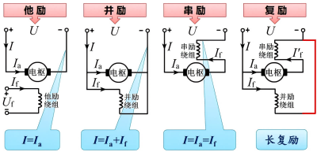
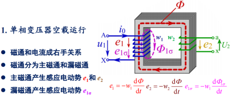
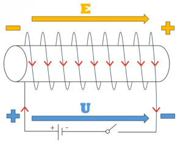
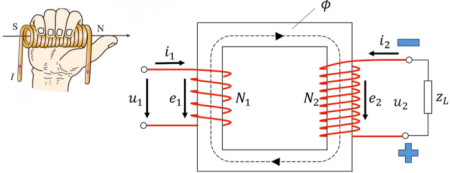

# 电气控制技术

???+note "课程资源"
    === "作业资源"
       [浙大b站网课](https://www.bilibili.com/video/BV1m54y1k7Vg/?spm_id_from=333.999.0.0&vd_source=ace17a48ec1787387c4c8d582e6808cb) 
    === "实验资料"
       [直流电机实验](https://wenku.baidu.com/view/e366a1c04028915f804dc25b?aggId=e366a1c04028915f804dc25b&fr=catalogMain_&_wkts_=1728694474010) 

## 电机学

### 直流电动机

基本结构：定子 转子

- 注：换向器相邻两片之间相互绝缘

#### 电枢绕组

- 电枢绕组：转子上的线圈（叠绕组、波绕组、蛙形绕组）

- 绕组元件：两端出线分别和两片换向片联接的单匝或多匝线圈

- 实槽数：电枢表面所开的嵌线槽，用 Z 表示

- 虚槽数：$Z_i$ = μZ 同一个槽内放置μ元件

  

- 元件数S、换向片数K和虚槽数$Z_i$相等

##### 叠绕组

- 适用于高电流
- 

- 单叠绕组的并联支路对数a和主磁极极对数p相等

- 电枢电流：$I_a = 2ai_a,其中i_a为每条支路的电流$

##### 波绕组

- 高电压（每条支路上电阻多）
- 

- 单波绕组的并联支路对数a=1
- 电枢电流：$I_a = 2ai_a,其中i_a为每条支路的电流$

#### 励磁方式

励磁方式是指**励磁绕组**中励磁电流的获得方式

一共有两套绕组：励磁绕组和电枢绕组

可以理解为电枢绕组先通电，然后通过以下几种方式使得励磁绕组获得励磁电流

复励分为长复励与短复励：

- 长复励：串励电阻与电枢串后再与并励电阻并
- 短复励：电枢与并励电阻并后再与串励电阻串

#### 直流电动机额定值

- 额定功率 $P_N$
- 额定电压 $U_N$ 
- 额定电流 $I_N$
- 额定转速 $n_N$
- 额定效率 $\eta_N$ 

 $P_N = U_N I_N \eta_N$

额定功率是指电动机的输出功率

#### 基本工作原理

换向器与电刷的共同作用使得外加直流，到电枢内部就变成了交流的形式，实现了持续旋转

##### 感应电动势

$$
每根导体感应的平均电动势: \quad e_{av} =B_{av}lv\\
导体切割磁场线的线速度: \quad v=\frac{2\pi R}{60}n = \frac{2p\tau}{60}n \\
电枢绕组感应电动势: \quad E = \frac{N}{2a}\frac{\Phi}{l\tau}l\frac{2p\tau n}{60} = \frac{pN}{60a}\Phi n = C_e \Phi n\\
其中C_e = \frac{pN}{60a}称为电动势常数
$$

##### 电磁转矩

$$
T_{em}=NB_{av}li_a \frac{D_a}{2}\\
T_{em} = N\frac{\Phi}{l\tau}l\frac{I_a}{2a}\frac{2p\tau}{2\pi}=\frac{pN}{2\pi a}\Phi I_a=C_T \Phi I_a\\
C_T=\frac{pN}{2\pi a} 称为转矩常数
$$

其中$C_T/C_e = 60/2\pi = 9.55$

#### 并励直流电动机的机械特性

### 变压器

#### 分类

- 相数：单相、三相
- 绕组：双绕组、三绕组、多绕组、自耦
- 冷却方式：油浸式、干式
- 铁心结构 ：芯式、壳式

#### 基本结构（非重点）

- 结构：铁心；高、低压两套绕组
- 铁芯：叠片式、渐开线式
  - 其中，叠片式又分芯式和壳式

#### 额定值

- 额定容量：$S_N$（视在功率VA）
  - **原边、副边的额定容量相等**
- 额定电压：原边$U_{1N}$,副边$U_{2N}$
  - **副边额定电压$U_{2N}$是变压器原边外加额定电压$U_{1N}$时副边的空载电压**
  - **三相变压器，额定电压指线电压**
- 额定电流：原边$I_{1N}$,副边$I_{2N}$
  - **单相变压器：** $I_{1N} = \frac{S_N}{U_{1N}}  \quad I_{2N} = \frac{S_N}{U_{2N}}$
  - **三相变压器：** $I_{1N} = \frac{S_N}{\sqrt{3}U_{1N}} \quad I_{2N} = \frac{S_N}{\sqrt{3}U_{2N}}$
- 额定频率：**$f_N = 50Hz$**

#### 基本工作原理

- 若磁通按正弦规律变化，即 $\Phi = \Phi_msin\omega t \quad e_1 = -w_1 \omega \Phi_m cos\omega t = 2 \pi fw_1 \Phi_m sin(\omega t -90^0)$
- 用向量表示有 $\dot{E_1}  = -j\sqrt{2} fw_1 \dot{ \Phi}_m$
- 同理有 $\dot{E_2}  = -j \sqrt{2} fw_2 \dot{ \Phi}_m$
- 变压器变比$k = \frac{E_1}{E_2}=\frac{w_1}{w_2} \simeq  \frac{U_{1N}}{U_{2N}}$

#### U和E正方向的判定

[变压器U&E方向标注_哔哩哔哩_bilibili](https://www.bilibili.com/video/BV1bj411x7VN/?spm_id_from=333.337.search-card.all.click&vd_source=ace17a48ec1787387c4c8d582e6808cb)

首先考虑一个简单的通电螺线管，将通电的螺线管看作一个电源，电源内部电流从负极流向正级，因此E和U的方向如下图所示

原边的方向与上述通电螺线管判断一致。再根据右手定则判断磁通的方向，如图$\phi$所示，再根据右手螺旋定则判断副边电流$i_2$的方向，再根据上面的方法判断E和U的方向。

