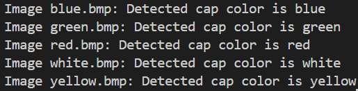
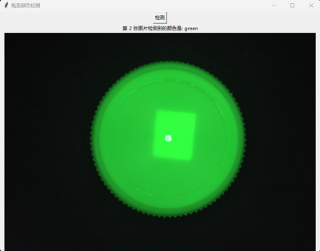

# 工业视觉

## 瓶盖颜色检测

- 图片HSV提取

```python
import cv2
import numpy as np
from matplotlib import pyplot as plt

image=cv2.imread('../picture/white.bmp')
HSV=cv2.cvtColor(image,cv2.COLOR_BGR2HSV)
def getpos(event,x,y,flags,param):
    if event==cv2.EVENT_LBUTTONDOWN: #定义一个鼠标左键按下去的事件
        print(HSV[y,x])

cv2.imshow("imageHSV",HSV)
cv2.imshow('image',image)
cv2.setMouseCallback("imageHSV",getpos)
cv2.waitKey(0)

```

运行之后，会出现 `png`和`hsv`两个图片，点击`hsv`的位置即可提取该点的值，然后获得该图片的颜色范围

- 颜色识别代码

  ```python
  import cv2
  import numpy as np
  import os
  
  # 定义颜色范围的字典，使用HSV颜色空间表示
  # 利用get_hsv.py获取图片的CSV范围（仅适用于本次lab，图中的white很像blue）
  COLOR_RANGES = {
      'red': [(0, 100, 100), (10, 255, 255)],
      'green': [(60, 190, 150), (70, 220, 255)],
      'blue': [(90, 100, 250), (125, 230, 255)],
      'yellow': [(30, 226, 187), (35, 238, 255)],
      'white':[(0,0,0),(110,80,255)]
  }
  
  # 定义函数来检测瓶盖颜色
  def detect_cap_color(image):
      # 将图片从BGR转换为HSV颜色空间
      hsv = cv2.cvtColor(image, cv2.COLOR_BGR2HSV)
      
      for color, (lower_range, upper_range) in COLOR_RANGES.items():
          # 转换为numpy数组，定义颜色范围
          lower_bound = np.array(lower_range)
          upper_bound = np.array(upper_range)
  
          # 创建遮罩，过滤出特定颜色范围的区域
          mask = cv2.inRange(hsv, lower_bound, upper_bound)
  
          # 计算遮罩中非零像素的数量，如果大于某个阈值，说明检测到了该颜色
          if cv2.countNonZero(mask) > 0:
              return color
      return 'Unknown'
  
  # 读取指定目录下的所有BMP图像并进行颜色检测
  def process_images(directory):
      for filename in os.listdir(directory):
          if filename.endswith(".bmp"):
              # 读取图像
              image_path = os.path.join(directory, filename)
              image = cv2.imread(image_path)
  
              # 检测颜色
              color = detect_cap_color(image)
  
              # 输出结果
              print(f"Image {filename}: Detected cap color is {color}")
  
  # 使用示例
  image_directory = '../picture'  # 替换为你的BMP图片集的路径
  process_images(image_directory)
  
  ```

  使用图片
  
  
  
  运行结果如下




!!! note 加入UI


```python
import cv2
import numpy as np
import os
from tkinter import Tk, Button, Label, Canvas, PhotoImage
from PIL import Image, ImageTk

# 定义颜色范围的字典，使用HSV颜色空间表示
# 利用get_hsv.py获取图片的CSV范围（仅适用于本次lab，图中的white很像blue）
COLOR_RANGES = {
    # 颜色名称映射到HSV颜色空间的上下界
    'red': [(0, 100, 100), (10, 255, 255)],    # 红色范围
    'green': [(60, 190, 150), (70, 220, 255)],  # 绿色范围
    'blue': [(90, 100, 250), (125, 230, 255)],  # 蓝色范围
    'yellow': [(30, 226, 187), (35, 238, 255)], # 黄色范围
    'white': [(0, 0, 0), (110, 80, 255)]        # 白色范围
}

# 定义函数来检测瓶盖颜色
def detect_cap_color(image):
    # 将图片从BGR转换为HSV颜色空间
    hsv = cv2.cvtColor(image, cv2.COLOR_BGR2HSV)
    
    # 遍历颜色范围字典中的每种颜色
    for color, (lower_range, upper_range) in COLOR_RANGES.items():
        # 转换为numpy数组，定义颜色范围
        lower_bound = np.array(lower_range, dtype="uint8")
        upper_bound = np.array(upper_range, dtype="uint8")

        # 创建遮罩，过滤出特定颜色范围的区域
        mask = cv2.inRange(hsv, lower_bound, upper_bound)

        # 计算遮罩中非零像素的数量，如果大于某个阈值，说明检测到了该颜色
        if cv2.countNonZero(mask) > 0:
            return color
    return 'Unknown'

# 定义检测图片并显示结果的函数
def detect_and_display():
    global image, result_label, canvas, image_label

    image_directory = '../picture'
    image_paths = [os.path.join(image_directory, f) for f in os.listdir(image_directory) if f.endswith('.bmp')]

    for i, image_path in enumerate(image_paths):
        image = cv2.imread(image_path)

        scale_percent = 30
        width = int(image.shape[1] * scale_percent / 100)
        height = int(image.shape[0] * scale_percent / 100)
        dim = (width, height)
        image = cv2.resize(image, dim, interpolation=cv2.INTER_AREA)

        # 显示正在检测的图片
        img_rgb = cv2.cvtColor(image, cv2.COLOR_BGR2RGB)
        img_pil = Image.fromarray(img_rgb)
        img_tk = ImageTk.PhotoImage(img_pil)
        image_label.config(image=img_tk)
        image_label.image = img_tk  # 保持引用

        color = detect_cap_color(image)
        result_label.config(text=f"第 {i+1} 张图片检测到的颜色是: {color}")

        root.after(2000)
        root.update()


# 创建Tkinter窗口
root = Tk()
root.title("瓶盖颜色检测")
root.geometry("800x600")  # 设置窗口大小为800x600


# 创建按钮
button = Button(root, text="检测", command=detect_and_display)
button.pack()

# 创建结果标签
result_label = Label(root, text="")
result_label.pack()

# 创建图片标签
image_label = Label(root)
image_label.pack()

root.mainloop()

```

运行结果



## 梳子缺齿检测

代码如下

```python
import cv2
import numpy as np

# 读取图片
image_path = '../picture/1.bmp'  # 替换为梳子图片路径
image = cv2.imread(image_path, cv2.IMREAD_GRAYSCALE)

# 图像预处理：进行模糊处理和二值化
blur = cv2.GaussianBlur(image, (5, 5), 0)
_, thresh = cv2.threshold(blur, 127, 255, cv2.THRESH_BINARY_INV)

# 进行边缘检测
edges = cv2.Canny(thresh, 50, 150)

# 查找轮廓
contours, _ = cv2.findContours(edges, cv2.RETR_EXTERNAL, cv2.CHAIN_APPROX_SIMPLE)

# 遍历轮廓，找到齿状物的区域
comb_teeth_count = 0
missing_teeth_count = 0

# 设置最小面积，避免噪声
min_area = 60  # 根据梳子齿大小调整此值
for contour in contours:
    area = cv2.contourArea(contour)
    if area > min_area:
        comb_teeth_count += 1

# 假设正常梳子有 n 个齿，计算缺失齿
expected_teeth_count = 36  # 根据实际梳子齿数修改
missing_teeth_count = expected_teeth_count - comb_teeth_count

print(f'梳子的齿数: {comb_teeth_count}')
print(f'缺失的齿数: {missing_teeth_count}')

# 缩放图像
scale_factor = 0.5  # 设置缩放比例，0.5表示缩小一半
resized_image = cv2.resize(edges, None, fx=scale_factor, fy=scale_factor, interpolation=cv2.INTER_LINEAR)

# 显示原始图像和处理后的缩放图像
cv2.imshow('Original Image', image)
cv2.imshow('Processed Image (Resized)', resized_image)
cv2.waitKey(0)
cv2.destroyAllWindows()

```

!!! bug 缺陷
	不同照片由于拍摄距离不同，其最小面积不同，因此不能广泛适用<br>
	

运行结果如下
	

!!! note 代码改进


```python
import cv2
import numpy as np

# Define image paths in order
image_paths = [f'../picture/{i}.bmp' for i in range(1, 9)]

frame_coords = {
    1: ([(1828, 1590), (1952, 962), (1816, 928), (1676, 1560)],
        [(1776, 1100), (1800, 992), (696, 714), (668, 807)],
        [(1720, 1340), (1744, 1259), (624, 982), (604, 1059)]),
    2: ([(1757, 1873), (2008, 1282), (1882, 1220), (1615, 1812)],
        [(1804, 1405), (1856, 1298), (832, 787), (788, 875)],
        [(1712, 1594), (1744, 1516), (700, 1020), (664, 1098)]),
    3: ([(1015, 1696), (1589, 1405), (1531, 1277), (943, 1558)],
        [(1392, 1346), (1472, 1307), (1004, 267), (932, 296)],
        [(1152, 1448), (1240, 1409), (760, 379), (672, 413)]),
    4: ([(893, 1478), (1436, 1822), (1516, 1706), (976, 1346)],
        [(1460, 1670), (2116, 729), (2032, 671), (1380, 1614)],
        [(1252, 1521), (1892, 573), (1820, 530), (1172, 1473)]),
    5: ([(350, 743), (324, 1390), (464, 1402), (504, 749)],
        [(1608, 1409), (1616, 1307), (472, 1210), (464, 1307)],
        [(1632, 1200), (1644, 1100), (492, 1020), (488, 1100)]),
    6: ([(1736, 1293), (1780, 671), (1648, 656), (1588, 1293)],
        [(1632, 836), (1640, 724), (508, 583), (495, 690)],
        [(1608, 1040), (1616, 943), (472, 830), (464, 923)]),
    7: ([(1308, 1650), (1300, 1510), (724, 1510), (724, 1650)],
        [(1268, 1497), (1264, 831), (1152, 831), (1152, 1497)],
        [(1070, 1510), (1030, 832), (930, 832), (970, 1510)]),
    8: ([(1868, 1147), (1872, 588), (1716, 583), (1708, 1162)],
        [(1712, 705), (1712, 603), (1048, 603), (1048, 705)],
        [(1708, 928), (1708, 828), (1040, 828), (1036, 938)])
}

def load_image(index):
    img = cv2.imread(image_paths[index])
    img_gray = cv2.cvtColor(img, cv2.COLOR_RGB2GRAY)
    return img, img_gray

def select_frame(img, coords, color):
    frame = np.array(coords, dtype=np.int32)
    cv2.polylines(img, [frame], True, color, 4)
    return frame

def calculate_variance(img_gray, frame):
    mask = np.zeros(img_gray.shape[:2], dtype=np.uint8)
    cv2.fillPoly(mask, [frame], 255)
    roi = img_gray[mask > 0]
    mean_value = np.mean(roi)
    variance = np.mean((roi - mean_value) ** 2)
    return mean_value, variance

def display_image(img):
    scaled_img = cv2.resize(img, (0, 0), fx=0.3, fy=0.3)
    cv2.imshow('Pre Image with Rectangle', cv2.GaussianBlur(scaled_img, (5, 5), 0))
    cv2.waitKey(0)
    cv2.destroyAllWindows()

def blob_selection(img_gray, frame):
    blurred = cv2.GaussianBlur(img_gray, (5, 5), 0)
    _, binary = cv2.threshold(blurred, 200, 240, cv2.THRESH_BINARY_INV)
    mask = np.zeros_like(binary)
    cv2.fillPoly(mask, [frame], 255)
    roi = cv2.bitwise_and(binary, binary, mask=mask)
    contours, _ = cv2.findContours(roi, cv2.RETR_EXTERNAL, cv2.CHAIN_APPROX_SIMPLE)
    filtered_contours = [cnt for cnt in contours if cv2.arcLength(cnt, True) >= 40]
    return len(filtered_contours)


if __name__ == "__main__":
    for index in range(len(image_paths)):
        img, img_gray = load_image(index)
        frames = frame_coords[index + 1]
        colors = [(0, 0, 255), (0, 255, 0), (255, 255, 0)]
        
        frame1_data = []
        frame2_data = []
        
        for i, coords in enumerate(frames):
            frame = select_frame(img, coords, colors[i])
            if i == 1:
                mean_value, variance = calculate_variance(img_gray, frame)
                frame1_data = [blob_selection(img_gray, frame), mean_value, variance]
            elif i == 2:
                mean_value, variance = calculate_variance(img_gray, frame)
                frame2_data = [blob_selection(img_gray, frame), mean_value, variance]
                
        missing_teeth = frame2_data[0] - frame1_data[0]
        
        dense_end = "绿色框: 密集端" if frame2_data[1] > frame1_data[1] else "蓝色框: 密集端" 
        
        print(f"图片 {index + 1}:")
        print(f"缺齿数: {missing_teeth}")
        print(f"{dense_end}")

        display_image(img)
```

手动画框来检测，有点呆，等待进一步改进


