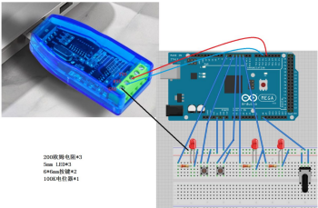

# Modbus

## Modbus主从机通信

从机要求

- 2路离散量输入（按键代替）
- 2路开关量控制，用LED模拟
- 一路模拟量输入，用电位器模拟（输入寄存器）
- 一路模拟量输出，用LED进行PWM调光（保持寄存器）

接线如下图



- 编辑器：Arduino
- 调用库：ModbusRTUSlave

具体代码如下

```C++
#include <ModbusRTUSlave.h>

const byte keyPins[2] = {4, 5};
const byte ledPins[3] = {2, 3, 7};
const byte potPin = A8;
const byte dePin = 13;

bool coils[2];
bool discreteInputs[2];
uint16_t holdingRegisters[1] = {0};
uint16_t inputRegisters[1] = {0};

ModbusRTUSlave modbus(Serial2, dePin);

void setup()
{
  Serial.begin(115200);
  Serial2.begin(115200);

  pinMode(keyPins[0], INPUT_PULLUP);
  pinMode(keyPins[1], INPUT_PULLUP);
  pinMode(ledPins[0], OUTPUT);
  pinMode(ledPins[1], OUTPUT);
  pinMode(ledPins[2], OUTPUT);
  pinMode(potPin, INPUT);

  
  modbus.configureCoils(coils, 2);                       
  modbus.configureDiscreteInputs(discreteInputs, 2);     
  modbus.configureHoldingRegisters(holdingRegisters, 1); 
  modbus.configureInputRegisters(inputRegisters, 1);     

  modbus.begin(1, 115200);
}

void loop()
{
  modbus.poll();

  discreteInputs[0] = digitalRead(keyPins[0]); //按键未按下，discreteInputs = 0；按键按下，discreteInputs = 1
  discreteInputs[1] = digitalRead(keyPins[1]);

  // Serial.print("Key 1: ");
  // Serial.println(digitalRead(keyPins[0]));
  // Serial.print("Key 2: ");
  // Serial.println(digitalRead(keyPins[1]));

  inputRegisters[0] = analogRead(potPin);
  //控制 LED(线圈状态)
  digitalWrite(ledPins[0], coils[0] ? HIGH : LOW);//根据线圈状态控制 LED
  // digitalWrite(ledPins[0], 1);//根据线圈状态控制 LED
  // Serial.print("coils[0]: ");
  // Serial.print(coils[0]);
  // Serial.print(" ");
  // Serial.print("coils[1]: ");
  // Serial.print(coils[1]);
  // Serial.print("\n");
  
  digitalWrite(ledPins[1], coils[1] ? HIGH : LOW);//根据线圈状态控制 LED
  //控制模拟量输出(LED PWM 调光)
  analogWrite(ledPins[2],holdingRegisters[0]);//根据保持寄存器的值调节 LED 亮度
}


```

