# 机器人导论


------

## 回忆卷

[2019-2020春夏部分考试回忆（机器人导论/自控原理/数据结构） - CC98论坛](https://www.cc98.org/topic/4960976)

[2019-2020春夏机器人导论回忆卷 - CC98论坛](https://www.cc98.org/topic/4961482)

[2020-2021春学期机器人导论回忆卷 - CC98论坛](https://www.cc98.org/topic/5070617)

[2021-2022 春 机器人导论 回忆卷 - CC98论坛](https://www.cc98.org/topic/5306507)

[2022-2023春机器人导论回忆卷 - CC98论坛](https://www.cc98.org/topic/5597275)

## 复习资料

[2023春《机器人导论》笔记分享 - CC98论坛](https://www.cc98.org/topic/5601621)

[2020-2021春学期《机器人导论》整理复习笔记分享 - CC98论坛](https://www.cc98.org/topic/5070984)

## 常考题目

 1、冯诺依曼结构的硬件结构 

2、巡线小车的框图和程序设计 

3、传感器的定义，根据智能家居机器人写四种传感器or分析超声波/激光传感器的原理及其各自的优缺点 （主要就是各个传感器的原理和优缺点）

4、五种旋转变直线的机构 

- 齿轮齿条传动结构
- 凸轮结构
- 曲柄摇杆结构（曲柄滑块）
- 带传动/链传动
- 滚珠丝杠传动机构
- 蜗轮蜗杆

直线变旋转（气动肌肉、齿轮齿条、曲柄滑块）

5、写出3绕组2极无刷直流电机（就课上讲的模型）的联结方式和导通状态图

------

## 正文

### 一、绪论

#### 工业机器人  

机器人是一种能够**进行编程**并在**自动控制下执行某些操作和移动作业任务**的机械装置

机器人是一种自动的、位置可控的、具有编程能力的多功能机械手，这种机械手具有几个轴，能够借助可编程序操作来处理各种材料、零件、工具和专用装置，以执行种种任务

用于**工业制造**或者**工业运输**,例如：

- 机械臂
- 工业运输机器人


#### 服务机器人

注：除了工业机器人都是服务机器人

指除从事工业生产以外的一大类半自主或全自主工作的机器人，能完成有益于人类的服务工作。

- 特殊环境下作业的机器人
- 服务于人的机器人
- 例：**自动坦克也是服务机器人** 、**防爆排雷、巡检**


#### 机器人的本质

机器人是一种人造的机器

机器人具有人类的特性：体能，智能

- 体能：依赖电荷、驱动和传动维持机器的运转
- 智能：依赖传感器和电子线路实现控制反馈过程

**所有**技术系统都是**生物系统**的**仿制品**


#### 机器人的核心技术

- 机器人的肌肉——驱动
- 机器人的骨骼——机构
- 机器人的运动——建模及控制
- 机器人的感官——传感器
- 机器人的知觉——识别理解
- 机器人的作业——决策规划
- 机器人的协作——多智能体


### 二、微控制器

#### 冯·诺依曼计算机结构（必考）

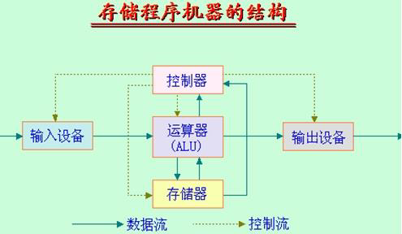

#### Arduino

##### 主代码

```c
//所有程序都写在下面两个函数里

/*开机的时候运行一次，各种设定放在setup（）里*/
Void setup（）
{
	Serial.begin（9600）；//设置波特率
}
/*不断循环*/
Void loop()
{
	Serial.println("Hello world!");
	delay(1000);//延迟1s
}


```


##### LED灯闪烁

```c++
#define led 13
Void setup（）
{
	pinMode(led,OUTPUT); //设定led管脚为输出引脚
}
Void loop()
{
	digitalWrite（led,HIGH); //设置led为高电平，点亮led
	delay(1000);//延迟1s
    digitalWrite（led,LOW); //设置led为低电平，熄灭led
	delay(1000);//延迟1s
}
```


##### Question

Q1：如何让LED不闪烁，但亮度只有正常的20%?

原理：人眨眼的频率有限，当闪烁频率低时，会认为没有闪烁

```C
#define led 13
Void setup（）
{
	pinMode(led,OUTPUT); //设定led管脚为输出引脚
}
Void loop()
{
	digitalWrite（led,HIGH); //设置led为高电平，点亮led
	delay(2);//延迟1s
    digitalWrite（led,LOW); //设置led为低电平，熄灭led
	delay(8);//延迟1s
}
```

Q2:原理的推广

- 输出电压调节（利用电容滤波）

​		PWM波					


- 电流电机控制
- 信号传输（舵机控制）

##### 相关知识

- delay()/delayMicroseconds()：用于延时，第一个单位为毫秒，第二个为微秒。  

- analogWrite():模拟 I/O 口输出，一般用于 PWM 输出，如：

  analogWrite(13,127)，为在13 号引脚处输出一个占空比为 50%的 PWM 方波，后一参数 0 表示关， 255 表示全开  

```C++
void setup()
{
    pinMode(13,OUTPUT);//设定13号端口为输出
}

void loop()
{
    digitalWrite(13,HIGH);
    delayMicroseconds(100);//大约10%占空比的1KHZ方波
    digitalWrite(13,LOW);
    delayMicroseconds(900);
}
```


### 三、传感器

#### 定义（考！）

用于**定量**感知环境**特定物质属性**的**电子、机械、化学设备**，并能够把各种物理量和化学量等**精确**地变换为**电信号**，再经由电子电路或计算机进行分析与处理，从而对这些量进行检测  

#### 传感器分类

##### 内部传感器

用于测量自身状态，一般用于底层运动控制  

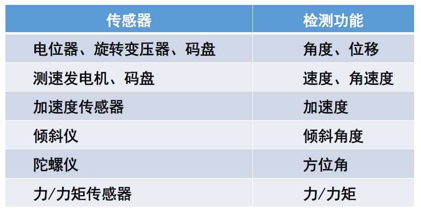


##### 外部传感器

测量机器人所处环境，部分用于底层控制，部分用于上层规划  

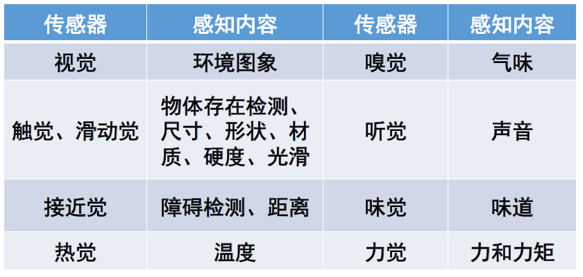

#### 传感器特性

##### 静态特性

指检测系统的输入为**不随时间变化**的恒定信号时，系统的输出与输入之间的关系

基本要求：输出相对于输入保持一定的对应关系

- 灵敏度 ：对输入信号变化的响应敏感度（**越高越好**）
- 信噪比（ S/N ）：传感器输出信号中信号分量与噪声分量的平方平均值之比
- 线性 ：输入与输出量之间为线性比例关系
- 稳定性： 输入量恒定，输出量向一个方向偏移（温漂/零漂）
- 精度：
  - **准确度**：测量值对真值的偏离程度；
  - **精密度**：测量相同对象，每次测量会得到不同测量值

##### 动态特性（响应特性）

指检测系统的输入为随时间变化的信号时，系统的输出与输入之间的关系  

- 瞬态响应特性
- 频率响应特性  

#### 传感器的选择

- 测量条件
- 传感器的性能
- 成本、尺寸、重量
- 使用条件

#### 运动传感器

- 位置传感器
- 速度传感器
- 加速度传感器
- **三者可以相互测量**


##### 电位器

- 旋转式：测量角位移

- 直线式：测量线位移

- 可以单独使用，也可以和其他传感器（如编码器）一起使用

  - 用电位器检测起始位置

  - 用编码器检测关节和连杆的当前位置


##### 编码器

根据测量结果分

- 增量式
- 绝对式

###### 增量式光电编码器


- 利用光栅透光、不透光得到方波进行计数
- **数得到了几个脉冲就可以知道转过多少角度**
- 存在抖动导致不知道转动方向的bug
- 解决方法：

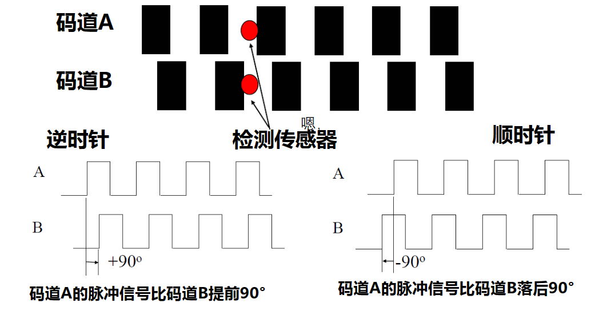

哪个先得到脉冲，方向就可以确定，两者脉冲有相位变化

###### 绝对式光电编码器


上面的位置都已经人为规定好了


##### 磁编码器

非接触，适合用在连续旋转物体上


##### 速度传感器

- 原理：利用磁编码器，统计指定时间内脉冲信号数量

- 缺点：时间间隔太长，导致测量误差大

- 改进：时间间隔长时，测量峰值之间的时间间隔（记周法）

  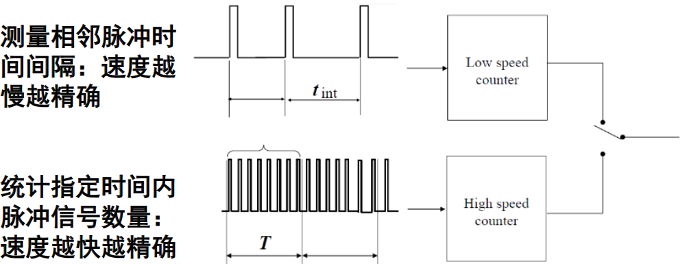

采样时间**越短**，速度值**约接近**实际的瞬时速度


##### 加速度传感器

- 基本原理：利用加速度造成某个介质产生变形，通过测量其变形量并用相关电路转化成电压输出
- F = ma


#### 方位角传感器

- 用于测量机器人的方向和倾角
- 可进行机器人位姿估计

##### 指南针

- 原理：地球南北极的磁力
- 缺点：易受其他磁性物质和人类环境的干扰

##### 陀螺仪

###### 机械陀螺仪

- 原理：运用物体高速旋转时，角动量很大，旋转轴会一直稳定指向一个方向的性质
- 缺点：工艺要求很高，结构复杂，精度受到多方面的制约

###### 光纤陀螺仪

- 原理：光束的速度保持不变，光干涉原理
- 优点：结构紧凑，灵敏度高，工作可靠
- 缺点：价格高

###### MEMS陀螺仪

- 原理：地球自转运动而作用于地球上运动质点的偏向力
- 优点：体积小、重量轻；低成本；低功耗；大量程；
- 缺点：**yaw角不准**

#### 测距传感器

接近觉

- 是一种粗略的距离感觉
- 主要作用：在不接触对象的条件下获得必要信息，为下一步运动（如避障、运动校正）做好准备

##### 光学接近觉传感器

###### 对置式

原理：用红外发光二极管发射红外光，根据接收器是否接收到红外光束确定是否有物体存在

###### 回波式

原理：红外发光二极管发射红外光束，若物体接近到一定程度，红外光照射于物体上物体将反射红外光束，反射光束由接收透镜收集后汇集在光电二极管上，光电管有光电流输出

##### 超声波接近觉传感器

###### 超声波测距仪

- 原理：**利用压电传感器生成声波，采用测量传输时间法测距**
- 优点：
  - 穿透性强


- 缺点：
  - 声波传输速度低，降低了感知速率
  - 声波束按锥形方式传播,张开角约20～40度使得方向分辨率较差
  - 软的物体表面将吸收大部分声音能量
  - 光滑的物体表面将形成镜面反射

###### 激光测距仪

​	三角法激光测距（扫地机器人）

​	发射激光经物体反射，反射光由线性CCD接收，按照三角公式进行计算

- 优点：结构简单、价格低

- 缺点：测量距离有限，远距离分辨率低

  ​					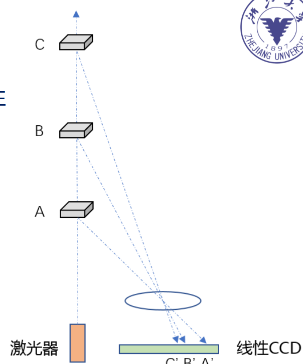

​	时飞法

- 优点：准确
- 缺点：测量时间精度要求高

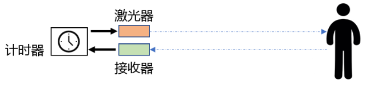

​	间接相位偏移测量法
$$
D = \frac{\Delta\varphi \lambda  }{4\pi} = \frac{\Delta\varphi V}{4\pi f}
$$

#### 其他传感器

##### 力觉传感器

###### 压阻式

原理：利用半导体压阻效应制成的力学量传感器

###### 压电式

原理：利用压电效应制成的力学量传感器

###### 电容式

原理：利用电容机理制成的力学量传感器，其核心是对压力敏感的电容器

##### 力矩传感器

原理：当力矩作用在弹性轴上，轴会产生扭曲变形，存在剪切应变和应力

##### 触觉传感器

##### 视觉传感器

- 原理：通过光学摄像机或红外、激光、超声、X射线对周围场景或物体进行探测成像
- 成像原理：小孔模型


### 四、机器人驱动

#### 驱动分类

##### 电机驱动

- 电机是日常生活中最常用和最普遍的驱动方式。

- 优点：控制调节简单、稳定性较好
- 缺点：力矩小、刚度低，常常需要配合减速器使用
- 应用：工业机器人、服务机器人等

##### 气压驱动

- 气压驱动以空气压缩为动力源，也是机器人驱动的一种重要形式。
- 气动式主要有气缸、气阀、管路等元件组成。
- 优点：气源获得方便、成本低、动作快。
- 缺点：输出功率小，体积大。一般而言，其工作噪声较大、控制精度较差。

##### 液压驱动

- 液压式主要有液压缸、液压马达、阀等组成。
- 优点：重量轻、尺寸小、动作平稳、快速性好、产生的力/力矩非常大。
- 缺点：易漏油、维护困难；不确定性和非线性因素多，控制和校正不如电气式方便。
- 在机器人中的应用较少，但正在逐步增加

##### 新型驱动

软体机器人的驱动方式主要取决于所使用的智能材料

- 介电弹性体（DE）
- 形状记忆合金（SMA）
- 形状记忆聚合物（SMP）
- 离子聚合物金属复合材料（IPMC）


#### 电机工作原理

注意：**力矩 X 转速 = 功率**

- 直流电机
  - 可以输出力矩和速度，如小车的直线运动、转弯等
  - 需要驱动芯片以及控制方式
- 舵机
  - 用于角度、位置伺服，如机械手转动
  - PWM波（占空比可变的方波）控制

##### 直流有刷电机

电机结构及工作原理

​				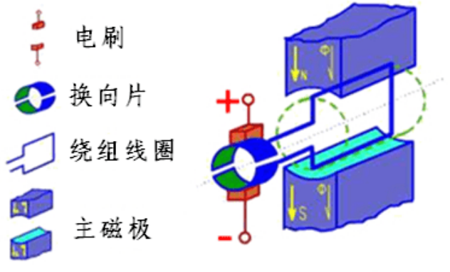

**左手定则**判断力的方向

有刷直流电机**由磁极、电枢绕组、电刷**和**换向片**组成。

- 磁极在工作中固定不动，称为定子（用于产生磁场）
- 电枢绕组是转动部分，称为转子
- 换向片与电刷有摩擦，会**降低其使用寿命**
- 无正负极之分
- 一般情况下绕组数量多于2个

##### 无刷直流电机

无刷直流电机由**电机本体、位置传感器、电子换向电路**三大部分组成。

- 电机主体由主定子、主转子组成。

- 主转子是永久磁铁，主定子是电枢。（与**有刷电机相反**）
  - 当定子绕组通直流电时，与转子作用产生电磁转矩
  - 定子电流必须根据转子的位置变化适时换向，才能获得单一方向的电磁转矩，使电机转动。


对于上面这张图来看

- figure 1 中，由于异性磁极相互吸引，同性磁极排斥，永磁铁发生偏转；
- figure 2中，当检测到永磁铁旋转180°之后，电源正负极互换，此时由于永磁铁旋转时存在惯性，会继续保持原来的方向偏转，再加上电源正负极呼唤之后导致的同性磁极排斥，就会不断地旋转


一般而言，无刷电机的绕组有**星形联结方式**和三角联结方式，而**三相星形联结（Y型）的二二导通方式最为常见**。

###### 三相3绕组2极（1对极）

​						

转动方向固定：AB--AC--BC--BA--CA--CB

如下图所示：不断循环该电流输入方向（**右手定则**），既可实现永磁铁的旋转

**注意：换相只与转子位置有关，与速度无关**

如何判断何时改变电流输入：一般在电机的不同位置上装三个**霍尔传感器**，就可测出转子的位置，


电路图：


如果V1、V2导通，则代表是AC

###### 三相9绕组6极（3对极）

转子的NS极与绕组电流产生的NS极有对其的运动趋势，这个惯性使得其能够旋转

注意：每一相是**串联**的


采用**9绕组6极**，而不是**6绕组6极**原因：为了防止定子的齿与转子的磁钢相吸而对齐，产生类似步进电机的效果，此情况下转矩会产生很大波动

##### 三个重要的物理量


电枢电动势Ea、电磁转矩T和电磁功率P
$$
E_{a} = K_{e}n \\
T = K_{m}I\\
P = E_{a}I = T𝜛 \\
$$

- 𝐾𝑒 是速度常数、𝐾𝑚 是力矩常数
- Ea比输入电压U小，因为会产生反电动势，但一般认为一样
- 𝑛是电机转速、𝐼是电枢电流、𝜛是角速度

- **转速与感应电动势成正比**
- **力矩与电流大小成正比**


##### 转矩和转速的关系

$$
𝑈=𝐸_𝑎+𝐼⋅𝑅_𝑎=𝐾_𝑒⋅𝑛+𝐼⋅𝑅_𝑎\\
𝑛=\frac{𝑈−𝐼⋅𝑅_𝑎}{𝐾_𝑒}
$$

​		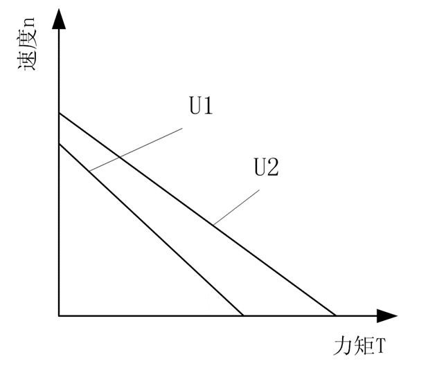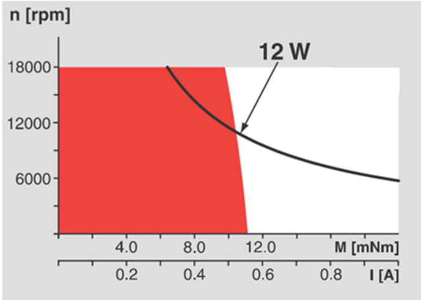

- 斜率(速度/转矩常数)越小，说明电机的刚性越好，越“硬”
- 斜率是电机本身决定的，与端电压和速度无关

​		**如何判断电机是否烧坏**

​		烧掉：功率过大----->电流变大------>发热------>电线外面绝缘层烧掉------>短路

​		可以测量绕组阻值是否正常（短路会造成电阻值改变）

​		可以加风扇改变

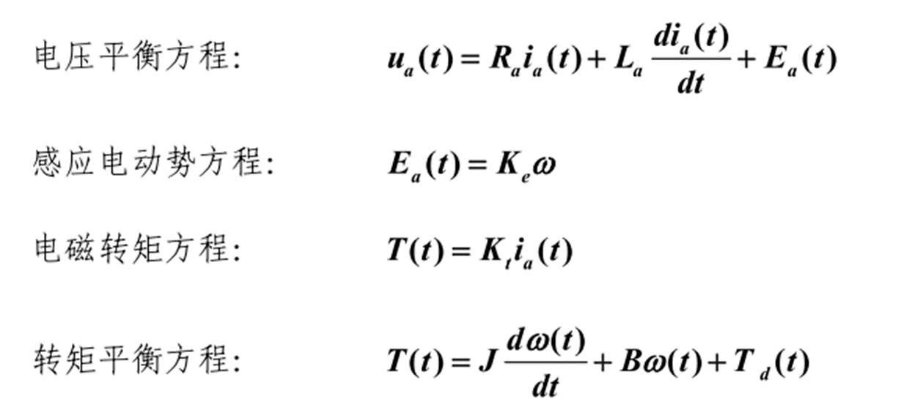


##### **转动惯量的匹配**

负载的转动惯量折合到主动轴上时，从动轴上的转动惯量和阻尼系数都要除于传动比的平方，负载转矩除于传动比


$$
J_L=J_1+\frac{J_2+J_3}{i_1^2 }+\frac{J_4}{i_1^2 i_2^2 }
$$
对于直流电机而言，高动态的伺服系统，一般要求：
$$
J_M < (2-3)J_L \\
电机的转动惯量 J_M、负载的等效转动惯量J_L
$$


##### 直流电机PWM调速

   用改变电机电枢电压接通与断开的时间占空比来控制电机转速的方法，称为**脉冲宽度调制(PWM)**。


在脉冲的作用下，当电机通电时，速度增加；电机断电时，速度逐渐减少。只要按一定规律改变通、断电时间，即可让电机转速得到控制。

设电机永远接通电源时，其转速最大为Vmax，设占空比为D=t1/T，则电机的平均速度为
$$
V_d= V_{max} D\\
$$
𝑉𝑑:电机的平均速度
𝑉max
𝐷=𝑡1/𝑇:占空比

- 电机的转速与电机电枢电压成比例，而电机电枢电压与控制波形的占空比成正比；
- 电机的速度与占空比成比例，占空比越大，电动机转得越快，当占空比等于1，电机转速最大。


#### 电机驱动

##### 机器人主要特征

- 运动
- 交互
- 感知
- 决策

##### **有刷电机（H桥驱动）**

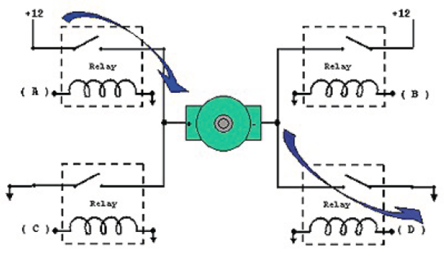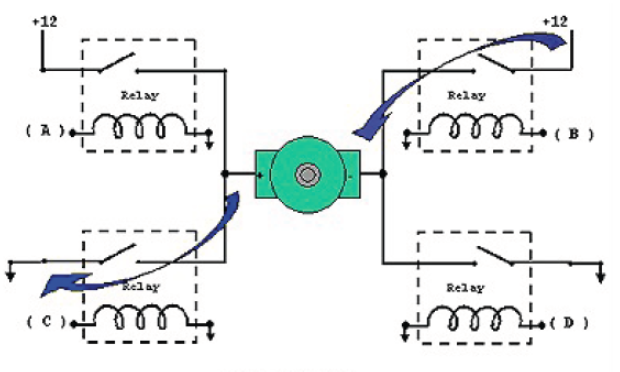

上图为电机的正反转


为了避免电机的反电动势的危害，仍然需要在三极管两端接二极管，因为电机线圈在电路开闭瞬间产生的反向电动势会高过电源，对晶体管和电路会造成影响，甚至是烧毁元件。

一般用**L298芯片**来控制电机转动

L298可以控制**两个**电机

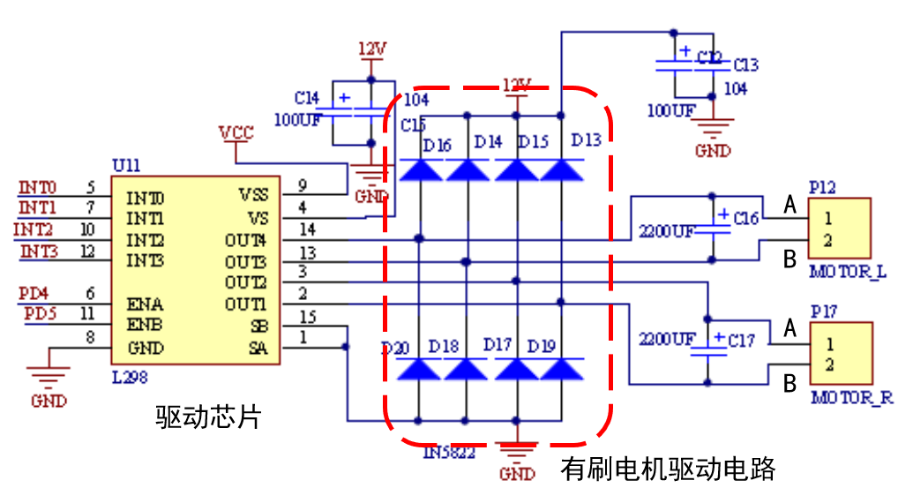


直流有刷电机控制A、B两相的输入：

- A为正，B为负的时候，电机进行正转；
- A为负，B为正的时候，电机进行反转；
- A、B都为正的时候，电机停止转动；


##### 光电隔离电路


可以实现抗干扰


##### 基本控制方式

###### 开环伺服系统

精度较低， 但稳定性最好。


###### 闭环伺服系统

精度较高，但系统的结构较复杂、成本高，还有系统稳定性的问题


###### 半闭环伺服系统

反馈电机信息，控制电机

精度比闭环要差一些，稳定性比闭环好，但比开环要差一些


#### 气动驱动

##### 分类

包括**气压元件、辅助元件、控制元件和执行元件**

- 气压元件：气源装置，其功能是将原动机**输入的机械能转换成流体的压力能**，为系统**提供动力**
- 执行元件：**气缸、气马达**，功能是将流体的压力能转换成机械能，输出力和速度或转矩和转速），以带动负载进行直线运动或旋转运动
- 控制元件：**压力、流量和方向控制阀**，作用是控制和调节系统中流体的压力、流量和流动方向，以保证执行元件达到所要求的输出力（或力矩）、运动速度和运动方向
- 辅助元件：保证系统正常工作所需要的辅助装置， 包括**管道、管接头、储气罐、过滤器和压力计**


##### 气体的特性

- 系统的压力应小于**8**个大气压（即0.8MPa）
- **不可压缩流体**
- **1**大气压=0.1013MPa=15psi(磅/平方英寸)


##### **方向控制回路**

###### 单作用气缸换向回路

**几位几通（考！）**
几位：看有几种回路可以切换

几通：看每一个回路里面有几个连接处


对于a图

在第二位时，右边气缸由于弹簧被压缩，向下运动

在第一位时，进气导致向上运动

对于b图

在第三位时（蓝色），向上

在第二位时（粉色），不动

在第一位时（黄色），向下

注：**有几位就有几种状态!**

###### 双作用气缸换向回路 


例：


不拍按钮时：左移

拍按钮时：右下角的被改变，因此右移


##### 气动肌肉

**气动人工肌肉**是一种体积小巧、柔软、重量轻、工作简单、容易控制的仿生学产品。它只能收缩到一定长度，具有较好的安全性

#### 液压驱动

- **将液体压力转化为机械能**
- 利用**不可压缩的流体**，将作用于某一点的力传递到另一点，这种流体通常是**工业液压油** 
- 由液压源、伺服阀、传感器、执行机构等构成
  - 优点： 重量轻、尺寸小、动作平稳、快速性好、产生的力 力矩非常大 。
  - 缺点： 易漏油、维护困难；不确定性和非线性因素多，控制和校正不如电气式方便

#### 新型驱动

气体软体机器人


#### 舵机

##### 舵机工作原理


**标准舵机有三条控制线，分别为**电源线、地线和控制线。控制线连接到控制芯片上

齿轮组：增大力矩，减小转速

控制电路：驱动器

比例电位器：检测角度

##### 舵机位置控制

- **舵机转动角度由PWM**（脉冲宽度调制）信号的占空比来实现；
- **PWM**周期为20ms，脉宽分布在**0.5**～**2.5ms**之间；
- **不同脉宽对应不同转角位置**

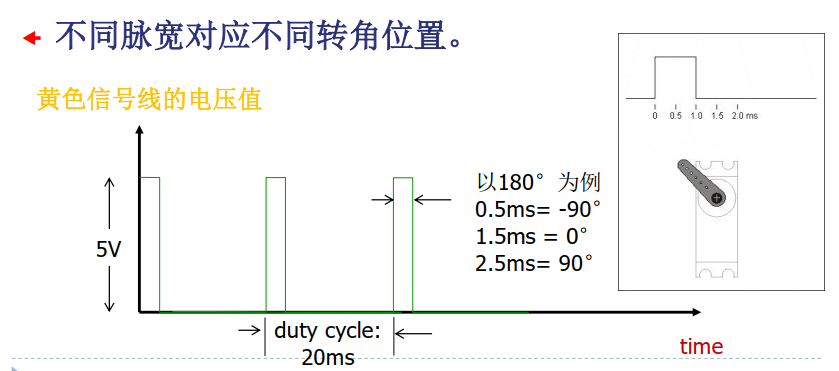

##### 电机减速器

- 传递能量传递：驱动----->机构
- 改变运动速度
- 改变运动力量
- 改变运动方向

 

#### 步进电机

步距角（每次转动的角度）

- 步距角越大精度越低
- 步距角越小，转速受到影响
- 电机的步距角固定，无法改变
- 控制方式：通过频率f来控制
  - 输入为脉冲信号，一个脉冲对应走一个步距角
  - 可以通过改变频率来改变速度和加速度，实现调速的目的


### 五、机器人设计与传动

#### 基础知识

##### 机器人结构组成

- 执行机构
  - 执行机构用于完成操作任务。它需要在动力源的带动下，完成预定的操作。如：直流电机、舵机和气缸等
- 传动机构
  - 传动机构是转速和转矩的变换器，如**齿轮**
- 支撑/导向机构
  - 导向机构作用是**支撑和导向**，使运动能安全、准确地完成特定方向的运动。如：轴承和导轨


##### 设计的流程

- 明确执行机构
- 确定传动方式
- 设计导向机构
- 结构设计
- 优化分析
- 组装与测试


##### 传动机构的性能要求

- 质量和转动惯量应尽量小。
- 刚度尽量大：伺服系统动力损失小（变形损失能量小）；
- 频率要高，超出机构的频带宽度，使之不易产生共振；
- 闭环系统更加稳定。
- 阻尼越大，振动的振幅就越小，衰减也越快。但大阻尼会使系统稳态误差增大、精度降低。
- 共振区域阻尼越大越好；远离共振区域阻尼越小越好。
- 其他要求：摩擦小、抗振性好、传动间隙小等


##### 减速比

减速比，也即**传动比**。指减速机构输入速度与输出速度之比，用“i”表示。即，*i* =输入速度/输出速度，并使输出力/力矩变为原来的i倍。
$$
i = \frac{输入速度}{输出速度} = \frac{输入力矩}{输出力矩}
$$
例：电机输入减速箱的速度1000n/min，输出速度10n/min，则减速比 i =1000/10=100

如电机输出力矩为Tin=0.1Nm，则输出力矩为Tout=Tin*i=0.1Nm*100=10Nm


##### 强度与刚度  

- 强度：零件在工作中发生**断裂或残余变形**均属于强度不足。
- 刚度：零件在工作中所产生的**弹性变形**不超过允许的限度。包括整体刚度和表面刚度两种。
- 相同的强度，结构不同，刚度不同


##### 刚体的自由度

定义：刚体本身具有可独立运动方向的数目。
$$
F = 6(l - n - 1) + \sum_{i = 1}^{n}f_{i} \\
l为连杆数（包括基座），n为关节总数，f_i为第i个关节的自由度数
$$
注：人的一条胳膊有7个自由度


##### 支撑和导向机构

- 轴承
  - 滑动轴承：应用于工作转速高、特大冲击与振动等场合。
  - 滚动轴承
- 直线导轨
- 导向轴
- 模具


#### 齿轮转动

齿轮传动是指由齿轮副传递运动和动力的装置，它是现代各种设备中应用最广泛的一种机械传动方式。

**优点**：传动比较准确，效率高，结构紧凑，工作可靠，寿命长。


##### 基本参数的计算公式

$$
p_i = s_i + e_i \quad s_i = e_i\\
模数m = \frac{p_i}{\pi}\\
国标压力角的标准值为20°\\
分度圆直径 d =mz (欲使两齿轮正确啮合，两轮的模数必须相等
)\\
定常传动比i_12 = \frac{\omega_1}{\omega_2} = \frac{O_2P}{O_1P} (P为节点)
$$

##### 齿轮轮系

- 定轴轮系：所有转动轴可以是平行的或者交错的；每个轴上可以有多个齿轮。
- 周转轮系：至少有一个齿轮的轴线不固定 ，而是绕另一个齿轮的轴线转动的轮系。
- 混合轮系


###### 定轴轮系

传动时，所有齿轮的**几何轴线为固定**的轮系。由一系列齿轮所组成的传动系统。

​	定轴齿轮箱：所有转动轴可以是平行的或者交错的；

​							每个轴上可以有多个齿轮。


###### 周转轮系

在齿轮系中，**至少有一个**齿轮的轴线**不固定**，而是绕另一个齿轮的轴线转动的轮系


###### 减速比计算（重点）


改错：
$$
i_{首末} = \frac{\omega_{首}}{\omega_{末}} = \frac{Z_末}{Z_首} \quad 包含正负 \\
本题答案 \\
i_{12} = \frac{\omega_1}{\omega_2} = -\frac{Z_2}{Z_1} \\
i_{23} = \frac{\omega_2}{\omega_3} = \frac{Z_3}{Z_2} \\
i_{33'} = \frac{\omega_3}{\omega_3'} = 1 \\
i_{3'4} = \frac{\omega_3'}{\omega_4} = -\frac{Z_4}{Z_3'} \\
i_{44'} = \frac{\omega_4}{\omega_4'} = 1\\
i_{4'5} = \frac{\omega_4'}{\omega_5} = -\frac{Z_5}{Z_4'} \\
综上：i_{15} = \frac{\omega_1}{\omega_5} = -\frac{Z_3}{Z_1}\frac{Z_4}{Z_3'}\frac{Z_5}{Z_4'} \\
$$


改错：
$$
i_{首末} = \frac{\omega_{首}}{\omega_{末}} = \frac{Z_末}{Z_首} \quad 包含正负 \\
本题答案 \\
i_{12} = \frac{\omega_1}{\omega_2} = -\frac{Z_2}{Z_1} \\
i_{22'} = \frac{\omega_2}{\omega_2'}  =1 \\
i_{2'3} = \frac{\omega_2'}{\omega_3} = \frac{Z_3}{Z_2'} \\
i_{33'} = \frac{\omega_3}{\omega_3'} =  1 \\
i_{3'4} = \frac{\omega_3'}{\omega_4} = -\frac{Z_4}{Z_3'} \\
i_{45} = \frac{\omega_4}{\omega_5} = -\frac{Z_5}{Z_4} \\
综上：i_{15} = \frac{\omega_1}{\omega_5} = -\frac{Z_2}{Z_1}\frac{Z_3}{Z_2'}\frac{Z_5}{Z_3'} \\
$$


#### 连杆传动

##### 平面四连杆机构

一般连杆传动都是四连杆结构

###### 常见结构

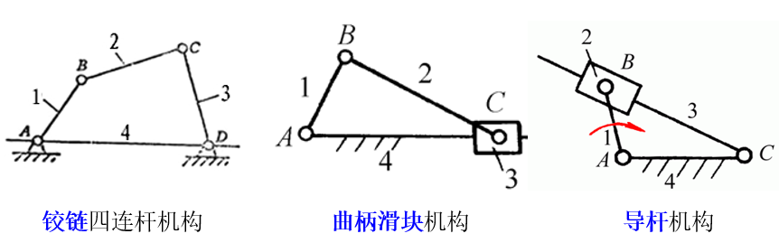

###### 优缺点（重点）

优点：

- 连杆机构中的运动副一般均为低副（连杆机构也称低副机构）低副元素之间为面接触，压强较小，承载能力较大；
- 可改变各构件的 长度使得从动件得到不同的运动规律；
- **可以设计出各种曲线轨迹**。

缺点：

- 需要经过中间构件传递运动，传递路线较长，易产生较大的误差，同时，**使得机械效率降低**
- 质心在作变速运动，所产生的惯性力难于用一般平衡方法加以消除，易增加机构的动载荷， **不适宜高速运动（相对于齿轮而言）**

##### 连杆的组成


##### 分类

###### 基本形式一：曲柄摇杆机构


###### 基本形式二：双曲柄机构

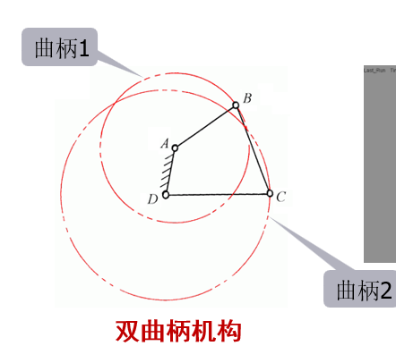

###### 基本形式三：双摇杆机构


###### 曲柄摇杆机构的条件

- 曲柄摇杆机构：两个连架杆中有一个为曲柄，另一个为摇杆：最短杆为连架杆 1 时
- 双曲柄机构：两个连架杆均为曲柄：最短杆为机架 4 时
- 双摇杆机构：两个连架杆均为摇杆：最短杆为连杆 2 时


#### 滑轮组

- 固定轮只能用于改变力的方向，而运动轮可以降低输入力量的大小
- 通过动滑轮，可以实现两倍的运动距离，但是需要的力矩需要增加一倍。


#### 带传动

##### 带传动

结构简单、传动平稳、造价低廉以及缓冲吸振


##### 链传动

是依靠链齿轮齿与链节的啮合来传递运动和动力，但在运转时**不能保证瞬时传动比**


##### 同步带

- 综合了带传动和链传动的优点
- 避免采用润滑油对橡胶材料的皮带进行润滑，易造成橡胶的膨胀，导致其网裂和硬化。


##### 蜗杆传动

- 传动比大，结构紧凑
- 传动平稳，噪声小。
- 具有自锁性。


#### 平面四连杆运动学  ——解析法

##### 步骤


- 总的来说就是列写矢量方程
- 再按照实部和虚部相等列写两个方程求解
- 速度与加速度对位移方程求导即可

##### 曲柄滑块机构

###### 位移分析


###### 速度分析

（位移求导）


###### 加速度分析


##### 曲柄摇杆机构

###### 位置分析


###### 速度分析


### 六、机器人机械设计

#### 轴系设计和联接

轴承的作用是:用来支撑轴

滚动轴承的特点：旋转精度高、启动力矩小、是标准件，选用方便

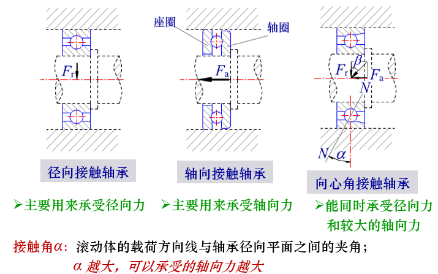


背！


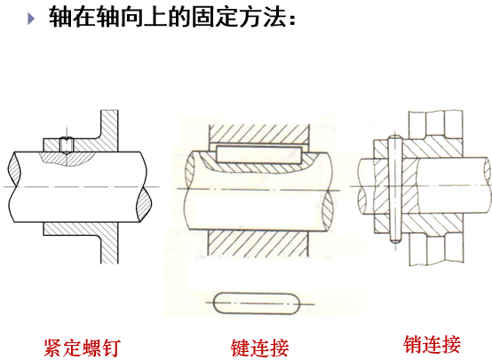

对于紧定螺钉，要90°再放一个

对于键连接，可以120°放三个，也可以隔180°放两个


### 七、机器人运动学

#### 运动学

 运动学（Kinematics）:是指机器人连杆的位置和姿态（简称：位姿）与关节角度关系的理论。

- 正运动学：已知关节角，求连杆末端的位姿
- 逆运动学：已知连杆末端的位姿，求关节角度

运动学只研究物体的运动而不考虑引起（或影响）这种运动的力

笛卡尔空间：通过笛卡尔坐标系统来描述机器人末端执行器（例如机器人手或工具）的位置和方向的空间。

关节空间：关节空间是通过机器人的关节参数来描述机器人配置的空间。

##### 正运动学

给定一组关节角的值，计算工具坐标系相对于基坐标系的位置和姿态，即末端执行器位置和姿态

##### 逆运动学

给定操作臂末端执行器的位置和姿态，计算所有可达位置和姿态的关节角

存在多解或者无解的情况（手臂7个自由度）


#### 坐标变换

最基本的转动:是绕  , 和  轴的旋转运动，分别称为滚动（roll）、俯仰（pitch）和偏摆（yaw）

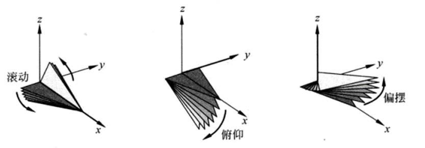

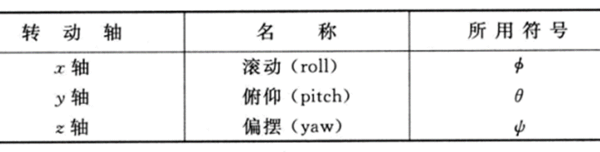


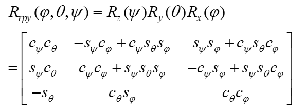


### 八、定位

#### 基本概念

里程估计

- 根据传感器感知信息推导机器人位姿（位置和角度）变化  
- 用途：
  -  航位推算 (Dead-reckoning)：基于已知位置， 利用里程估计，推算现在位置

里程估计方法  

- 基于机器人运动感知信息，结合运动学模型
  - 电机码盘
  - IMU（惯性单元，加速度计+陀螺仪）
- 基于环境感知传感器信息，通过最佳匹配估计
  -  激光里程计
  -  视觉里程计（VO）

#### 基于运动感知的里程估计  

##### 基于电机码盘的轮式移动机器人里程估计  

###### 方式

根据电机码盘获得轮子转速  

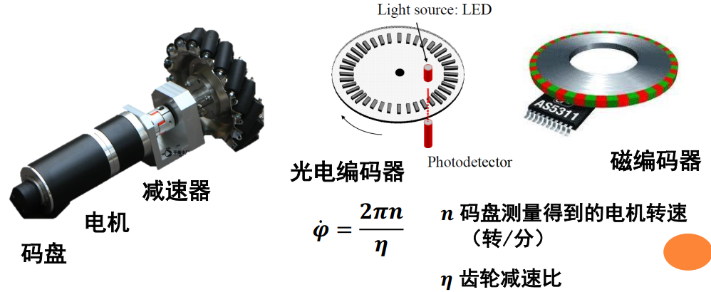
$$
角速度计算公式 \\
\omega = \Phi ' = \frac{2 \pi n}{η}
$$

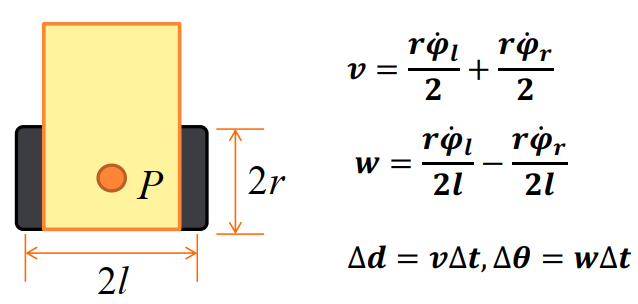


对于速度

- 考虑一个轮子固定，则另一个轮子的速度就是rω
- 相对于质心P点速度就是rω/2
- 相加即可

对于角速度

- 同样考虑一个轮子固定，则另一个轮子角速度就是ω
- 故质心角速度也是rω/2l
- 由于两个轮子角速度相反，故为减法

###### 缺点

**累计误差变大**：在航位推算时，里程计**误差被累加**，推算随着时间而增长  

各种误差太大


##### 基于惯性单元的里程估计  

惯性单元IMU  

- 一般含有三轴的加速度计和三轴的陀螺仪
- yaw不准

- 优点
  - 全天候
  - 采样频率高
  - 短时精度较好
- 缺点
  - 随着时间的增长累积误差较大，无法满足移动机器人长距离精确定位的要求，需要融合其它传感器进行组合导航


#### 激光里程计  

采用ICP(Iterative Closest Point)算法  

- 估计P’集合点与P集合点的初始位姿关系  
  - P'是P点相对于里程计的坐标系下位置改变后的坐标
- 根据最近邻域规则建立P’集合点与P集合点的关联  
  - 构建旋转矩阵，使得P'旋转之后成为P点
- 利用线性代数/非线性优化的方式估计旋转平移量  
  - 优化旋转矩阵
- 对点集合P’的点进行旋转平移  
- 如果旋转平移后重新关联的均方差小于阈值， 结束
- 否则迭代重复上述步骤  


#### 定位问题

确定机器人在世界（全局）坐标系中的位置/位姿  

分为三种解决方法：

- **基于外部设备感知的定位**  
- **基于里程估计的航位推算**  
- **基于本体设备感知的定位**  

##### 基于外部设备感知的定位  

###### 全球定位系统GPS  

由**空间端、 控制端和用户端**三部分组成，也称为GNSS

- 空间端由卫星组成
- 控制端由地面天线站等构成，主要作用监测控制卫星的运行，并对卫星进行时间同步  
- 用户端，采用三点法进行定位


存在问题

遮挡问题：室内难以使用

多路径问题：楼房太高导致最短路径变成反射后的一条路径


###### 全局视觉观测定位  

搭建一套外部视觉系统，识别机器人，确定其位置  

与GPS相同，在内部搭建多个相机实现定位


应用约束：

- 摄像头有视野范围约束，当环境较大时需要多个摄像头
- 机器人上也需要有一定的标识方便图像识别定位


##### 基于本体感知的定位  

- 需要预先构建地图，地图坐标系在构建地图时确定
- 对于大规模环境，路标需具备可鉴别性，否则需要正确的数据关联
- 存储大规模环境的图片需要较大的存储空间
- 对于实际环境中存在路标被破坏/污染、更换、稀疏等风险


###### 基于环境人工标识的定位

在环境中部署特殊标签，降低成本，确保可靠性，如

- 地面二维码：适合仓库运输机器人
- 高反射物质：适合叉车

###### 基于环境自然标识的定位  

路标


###### 基于空间标识的定位原理  

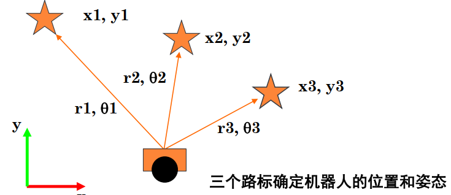

已知三个星星的坐标，并通过传感器测得r或者θ，进行求解坐标


###### 基于位置识别的定位

基本思想：利用本体传感器获得的信息与地图中存储的各个位置上的信息进行匹配，实现位置识别

应用约束：

- 环境的动态变化和不同位置的相似性，对位置辨别带来挑战
-  为适应环境的动态变化，可以考虑对每个位置存储多张图片，但增加存储空间需求
- 图像匹配是一个耗时的工作


##### 控制感知信息融合的自定位  

定义：在给定环境地图(对环境的已有知识)的条件下，根据机器人的运动控制/里程估计信息和传感器感知数据(当前认知)估计机器人相对于环境地图的坐标

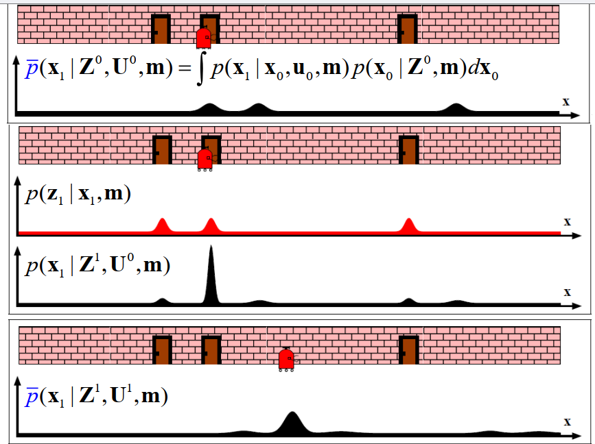


### 九、机器人视觉

[三维视觉测量技术：“被动”和“主动”视觉测量 - 知乎 (zhihu.com)](https://zhuanlan.zhihu.com/p/590263368)

#### 被动视觉传感器

定义：**被动视觉测量**不需要特殊的照明投射装置，仅利用相机拍摄被测物的图像，建立被测物与相机之间的相对位置关系，从而获取被测物表面的三维信息

原理：借助外部光源的漫反射并结合小孔成像

CCD传感器：放在成像面的一块具有反光能力的芯片

缺点：

- 无法获得物体的深度和大小（了解大小需要参照物 ）
- 在外部光弱的情况下无法成像，依赖于外部环境影响

双目相机可以获得深度


- 视差角的概念（图中a）
- 需要认识两个图片直接的像素关系
  - 改进措施：左目主动发射光源


#### 主动视觉传感器

主动视觉测量与被动视觉测量最大的不同在于需要向被测物体投射光源


#### 机器人视觉应用

- 划痕检测
- 土壤分析
- 文字识别
- 人脸识别
- 视觉定位、导航

视觉提供了一种**几何测量**的工具，也提供一种**语义认知**的工具

各种视觉应用是两种工具功能的组合


#### 图像函数

图像是定义在CCD阵列下的离散函数  
$$
I:(u,v) ∈ [0,W-1] × [0,H-1] → q ∈ R^N  \\
q = I(x)
$$
W,H分别为像素格数（横纵）


##### 成像原理


**漫反射**无法成像


依靠小孔成像实现


用𝑐𝑥， 𝑐𝑦表示图像坐标系下的光心  

引入 R， t 表示实际世界坐标和相机中心之间的位姿  

##### 镜头畸变


##### 相机标定

借助外部已知尺寸的物体，解算出内参  

- 采用棋盘格作为已知尺寸的物体，利用平面特性方便求解  
- 棋盘格的角点检测相对简单，可靠性高  

##### 外参应用

- 基于指定尺寸平面，可以估计出平面和相机的外参，也就是相机在世界坐标系下的位姿
- 如果在世界坐标系下，增加一个虚拟点，可以计算出在图像中的成像  


### 十、机器人规划

[移动机器人规划 - 概述-CSDN博客](https://blog.csdn.net/BigDavid123/article/details/135613599)（深蓝学院课程）

[机器人学——（五）规划和导航 - 知乎 (zhihu.com)](https://zhuanlan.zhihu.com/p/664875047#:~:text=机器人路径规划是机器人学中的一个重要组成部分，它主要关注如何使机器人从一个位置移动到另一个位置，同时避免碰撞和满足其他可能的约束条件。,路径规划的目的是找到一条从起点到终点的路径，而不会遇到障碍物，同时可能会尽量减少路径长度或者满足其他一些优化准则，如最小能耗或最小时间。)

#### 运动规划

基本要求

- 安全：避免碰撞
- 光滑性：节能、平稳
- 动力学可行性：可执行、可控

通用运动规划方法

- 前端-路径搜索
  - 低维
  - 离散空间
  - 搜索初始安全路径
- 后端-轨迹优化
  -  高维
  - 连续空间
  - 生成可执行轨迹

#### 前端—路径搜索

基于搜索的方法

- Graph Search：DFS、BFS
- Dijkstra and A* search
- Jump Point Search (JPS)

基于采样的方法

- Probabilistic roadmap (PRM)
-  Rapidly exploring random tree (RRT)
- RRT*


##### PRM

基于概率采样的路径

- 均匀生成采样点
- 将与障碍物接触的点给删除
- 领域点计算：在距离为r的园内均为领域点，将其连接
- 碰撞检测：连线是否与障碍物相交

优点：产生的roadmap可以被复用

缺点：对于给定的起点和终点，非最短路径，效率低


[基于采样的运动规划算法-RRT(Rapidly-exploring Random Trees) - 知乎 (zhihu.com)](https://zhuanlan.zhihu.com/p/133224593)

##### RRT

- 概率采样，投影
- 与最近点相连接，生成树

优点：容易添加对目标点的引导，效率增加

缺点：无法删除已生成树，但不一定是最短


##### RRT*

相比于RRT增加了Rewrie函数

即在采样之后与最短路径连接后，考虑在某一个定长的圆的范围内，其内的点是否可以连接到新采样的点（用到初始点的距离进行判断）


[【算法】路径规划中的Dijkstra(狄克斯特拉)与A星算法_dijkstra和a星算法的差异-CSDN博客](https://blog.csdn.net/QLeelq/article/details/113862917)

##### Dijkstra’s

加了权重的广度优先算法

- **优点**: 
  - **准确性**: 总是能找到最短路径。
  - **简单性**: 实现相对简单。
- **缺点**: 
  - **效率较低**: 算法需要遍历图中的大多数节点，可能导致较高的计算成本。
  - **实时性差**: 在动态环境中可能不适用，因为它不能快速适应环境的变化

##### A*

在Dijkstra's算法的基础上，加了对于距离目标点的预测方向，因而有了更强的目的性（启发式算法）

- **优点**: 
  - **效率较高**: 通过启发式函数，A*算法能够减少需要遍历的节点数量，从而显著提高搜索效率。
  - **准确性**: 同样能够找到最短路径。
  - **灵活性**: 通过改变启发式函数，可以很容易地对算法进行定制。
- **缺点**: 
  - **启发式函数选择**: 启发式函数的选择对算法的性能有很大影响，不恰当的启发式函数可能导致搜索效率降低。
  - **实时性**: 虽然比Dijkstra算法更高效，但在高度动态的环境中仍可能面临挑战。

##### JPS

在图上搜素


三者都是最优解

#### 后端—轨迹优化

##### Basic Minimum-snap  


##### 硬约束与软约束轨迹优化  

###### Hard constrained Minimum-snap  

###### Soft Constrained Trajectory Optimization


### 十一、机器人集群

#### 三种算法

##### 基于Virtual Structures的编队控制  (虚拟结构体)

又叫VRB

###### 要求：

- 保持队形
- 导航要求：到达目标位置
- 实现避战

###### 实现方法

1.保持队形

- 在世界坐标系𝓕𝝎下，考虑VRB的轨迹，此时集群被视为一个整体，规划虚拟刚体质心的轨迹
- 在局部参考坐标系𝓕𝒗下，考虑控制每个独立个体的轨迹

2.避障

人工势场法

- 编队势能场  ：吸引到达目标位置
- 相互躲避势能场  ：排斥相互远离

- 优点：实时性强、防突发威胁强
- 缺点：局部困扰现象


##### VO (Velocity Obstacle)  


优点：复杂度低

缺点： 每个机器人只考虑其它机器人当前的速度，而不考虑其他机器人下一个控制周期的速度  

假设一个虚拟的速度障碍，任何落在蓝色区域以内的速度矢量最后都会让两物体相撞


VO 的震荡问题

只考虑其他机器人的当前速度，而不考虑其他机器人下一控制周期的速度。

改进 - RVO | reciprocal velocity obstacle

如果 B 不动的话，A 需要承担所有的避障职责

如果 B 动的话，AB 各承担 50% 的避障职责


##### 生物群落模型  

基本思想： 为实现像鸟群一样的一致飞行，每一个体的运动由三股力量（速度）决定：

- 短距离：与邻居、障碍物的排斥速度𝐯^𝑟𝑒𝑝，越靠近斥力越大； 
-  中距离：运动对齐速度𝐯^𝑓𝑟𝑖𝑐𝑡，越偏离权重越大；
- 长距离：远方目标的引力𝐯^𝑓𝑙𝑜𝑐𝑘，一定范围内维持未定；执行速度为三类速度的矢量  

$$
v^{exe} = v^{rep} + v^{frict} +v^{flock}
$$

应用难点： 参数繁多且对参数灵敏

解决办法： 进化算法调参  


------


## 关于历年卷的一些题目

#### 2022-2023

##### Q1

机器人的组成

机器人是一种人造的机器

机器人具有人类的特性：体能，智能

- 体能：依赖电荷、驱动和传动维持机器的运转
- 智能：依赖传感器和电子线路实现控制反馈过程

##### Q2

说明微控制器的冯诺依曼结构


##### Q3

机器人传感器的定义？传感器在机器人系统中的作用？假如你正在设计一款智能移动家居机器人，请设计四个所需要的传感器，并说明原理和作用

定义：用于**定量**感知环境**特定物质属性**的**电子、机械、化学设备**，并能够把各种物理量和化学量等**精确**地变换为**电信号**，再经由电子电路或计算机进行分析与处理，从而对这些量进行检测  

作用：

设计：

**激光距离传感器/激光雷达（LIDAR）**   -

- **原理：** 激光雷达通过发射激光脉冲并测量反射回来的光波的时间来计算距离。   
- **作用：** 用于测量机器人周围物体的距离和位置，帮助进行导航、避障和地图构建。 

**视觉传感器/摄像头**   

- **原理：** 摄像头通过捕捉光线并将其转换为电子图像来模拟人类的视觉。   
- **作用：** 用于视觉处理和识别，如识别室内的物品、门牌号或家庭成员的脸，以及为机器人视觉导航提供必要数据。 

 **触觉传感器**   

- **原理：** 触觉传感器在接触到物体时能够检测到压力或力量的变化。   
- **作用：** 用于确保机器人在与家具或人互动时的安全性，比如在抓取物品时施加适当的力，或者在碰撞即将发生时停止移动。 

**红外传感器/接近传感器**   

- **原理：** 红外传感器通过发射红外光线并检测从表面反射回来的光线来检测物体的存在和距离。   
-  **作用：** 用于在比较近的距离内检测和避免障碍物，并帮助在低照明条件下导航。 这些传感器协同工作，使得智能移动家居机器人能够完成其设计目标，如自主导航，执行清洁或整理任务，以及与家庭成员互动。根据设计需求和成本限制，可能还会融入其他类型的传感器，以增强机器人的功能和提高互动品质。

##### Q4

双轮差速巡线小车，请画出巡线流程图，并编写一个简单的巡线用Arduino程序，简单注释

流程图

```
开始
|
v
初始化传感器和电机
|
v
循环开始
|      -----------------------
|      | 读取左右巡线传感器 | 
v      -----------------------
|
判断左右传感器值
|
+-------------+-------------+
| 左传感器检测到线（黑色）  | 右传感器检测到线（黑色）
+-------------+-------------+
|             |             |
让右轮加速   让左轮加速
让左轮保持低速  让右轮保持低速
|             |            
+------> 直行      
|             
|
v
结束循环
```


```C++
// 定义Arduino引脚
const int leftSensorPin = 2; // 左侧巡线传感器连接的引脚
const int rightSensorPin = 3; // 右侧巡线传感器连接的引脚
const int leftMotorPin = 9; // 左侧电机控制引脚
const int rightMotorPin = 10; // 右侧电机控制引脚

// 定义电机速度
const int highSpeed = 255; // 高速
const int lowSpeed = 150; // 低速

void setup() {
  pinMode(leftSensorPin, INPUT);
  pinMode(rightSensorPin, INPUT);
  pinMode(leftMotorPin, OUTPUT);
  pinMode(rightMotorPin, OUTPUT);
}

void loop() {
  // 读取传感器值
  int leftSensorValue = digitalRead(leftSensorPin);
  int rightSensorValue = digitalRead(rightSensorPin);

  // 判断传感器的状态并调整电机速度
  if (leftSensorValue == HIGH && rightSensorValue == LOW) {
    // 左侧检测到线，右侧未检测到线，向右转
    analogWrite(leftMotorPin, highSpeed);
    analogWrite(rightMotorPin, lowSpeed);
  } else if (rightSensorValue == HIGH && leftSensorValue == LOW) {
    // 右侧检测到线，左侧未检测到线，向左转
    analogWrite(rightMotorPin, highSpeed);
    analogWrite(leftMotorPin, lowSpeed);
  } else {
    // 如果都未检测到或者都检测到了，直行
    analogWrite(leftMotorPin, highSpeed);
    analogWrite(rightMotorPin, highSpeed);
  }
}
```

##### Q5

串励直流电机 

- （1）写出电压平衡方程 
- （2）写出转矩平衡方程
-  （3）用20kHz的pwm波调速，达到60%额定转速时的脉宽t1？


设电机永远接通电源时，其转速最大为Vmax，设占空比为D=t1/T，则电机的平均速度为
$$
V_d= V_{max} D\\
$$
故D = 60%，可以求出t1 = 30μs

##### Q6

定轴轮系 （1）几级减速？ （2）模数是1，求齿轮1的分度圆直径 （3）计算减速比

（几级减速如何判断）


##### Q7

被动视觉传感器的优缺点

优点：


缺点：

- 无法获得物体的深度和大小（了解大小需要参照物 ）
- 在外部光弱的情况下无法成像，依赖于外部环境影响

##### Q8

机器人的路径规划 （1）机器人的路径规划有基于采样和基于搜索两种方案，请列举四种路径规划方法（两种基于采样的，两种基于搜索的） （2）选择（1）中的一种算法，描述具体原理 （3）路径规划在机器人系统中的作用？理想功能？


（3）

- 作用：机器人路径规划在确保机器人安全、提高机器人操作效率、实现机器人的自主导航和适应不同环境中的导航等方面发挥了重要的作用，是机器人学中不可或缺的一部分
- 理想功能


#### 预测题目

##### Q1

列举工业机器人和服务机器人

工业：食品分拣、机械臂、搬运机器人（电商物流）、焊接机器人

服务：扫地机器人、军事无人机、微创手术机器人

##### Q2

机器人的定义（本质）

##### Q3

说明微控制器的冯诺依曼结构

##### Q4

机器人传感器的定义？传感器在机器人系统中的作用？假如你正在设计一款智能移动家居机器人，请设计四个所需要的传感器，并说明原理和作用

##### Q5

超声波测距仪和激光测距仪

###### 超声波测距仪

- 原理：**利用压电传感器生成声波，采用测量传输时间法测距**、
- 缺点：
  - 声波传输速度低，降低了感知速率
  - 声波束按锥形方式传播,张开角约20～40度使得方向分辨率较差
  - 软的物体表面将吸收大部分声音能量
  - 光滑的物体表面将形成镜面反射

###### 激光测距仪

​	三角法激光测距（扫地机器人）

​	发射激光经物体反射，反射光由线性CCD接收，按照三角公式进行计算

- 优点：结构简单、价格低

- 缺点：测量距离有限，远距离分辨率低


