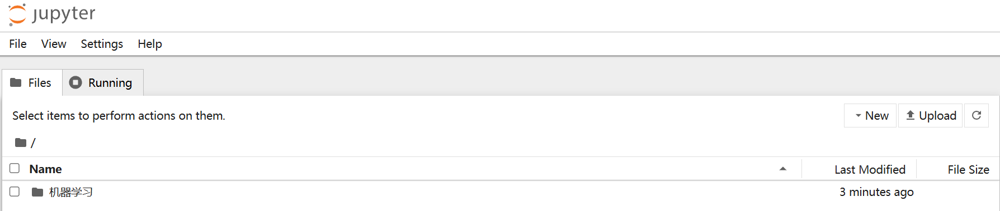

# Jupyter Notebook

## 安装

本地有anaconda，故直接可以打开,在终端输入下面指令，会直接跳转到浏览器

```python
jupyter notebook
```


## 修改文件地址


一般的默认地址 `C:\Users\用户名`

命令行输入

```
jupyter notebook --generate-config
```


在文件管理器打开该文件，将路径修改成自己的文件夹下


这样就改好了

