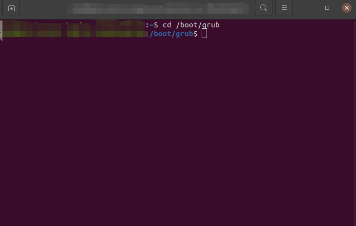
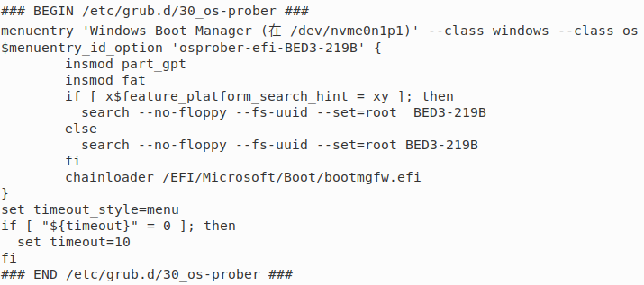
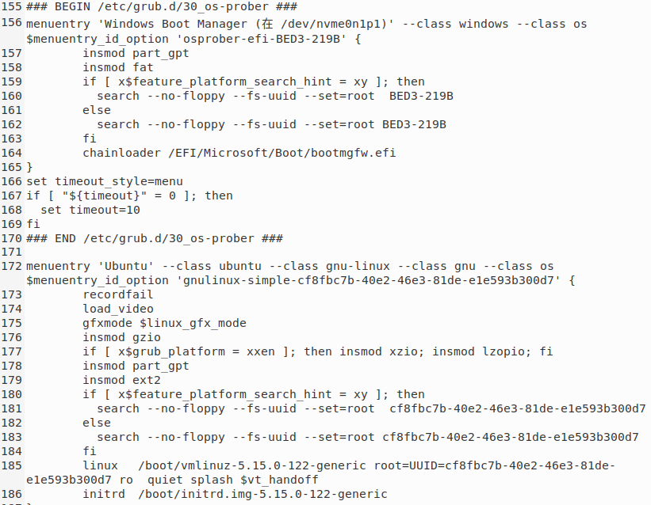
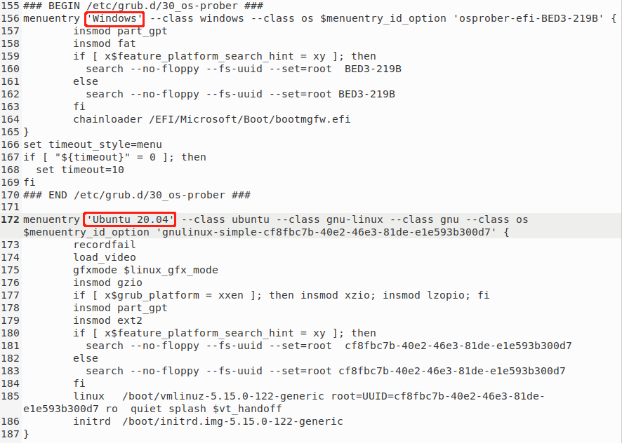

# Windows和Ubuntu双系统更改开机默认启动顺序

!!!bug Attention 
    如果是联想拯救者，请不要插着PD快充开机，否则会导致cfg文件重置 

## 1.打开终端进入/boot/grub/目录

`cd /boot/grub`

## 2.编辑grub.cfg文件

`sudo gedit grub.cfg`输入电脑密码开始编辑

!!!note 备份文件
    如果担心编辑出错，可以先保存文件再编辑 
    `mv grub.cfg grub.cfg.back`  

# 3.找到windows的位置

# 4.粘贴到ubuntu之前

# 5.保存，重启

# 6.美化措施

可以自行命名，修改结果会在boot界面显示

