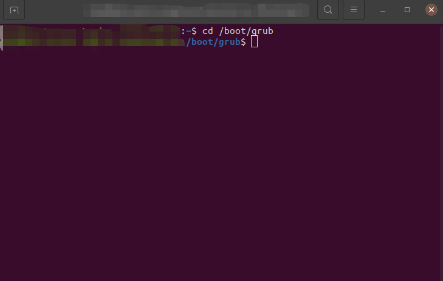
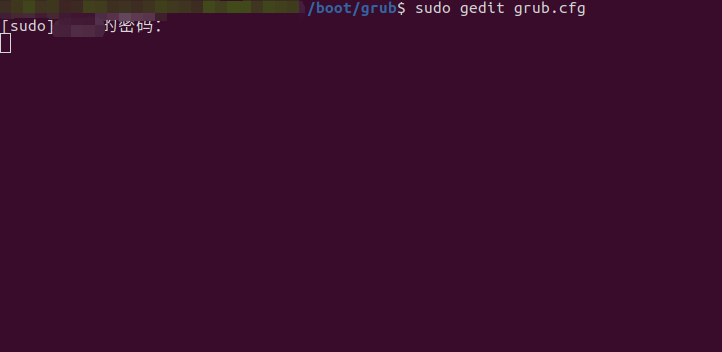
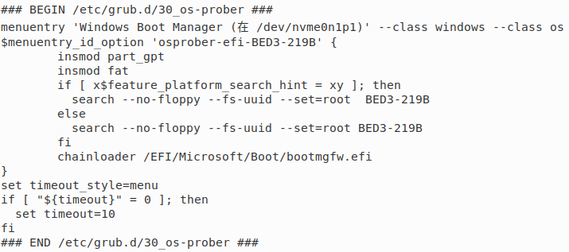
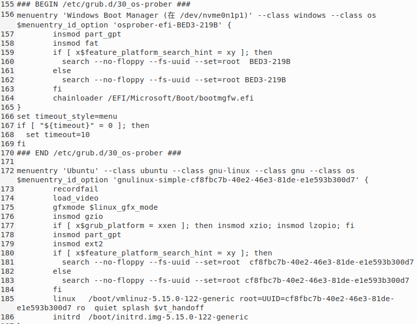
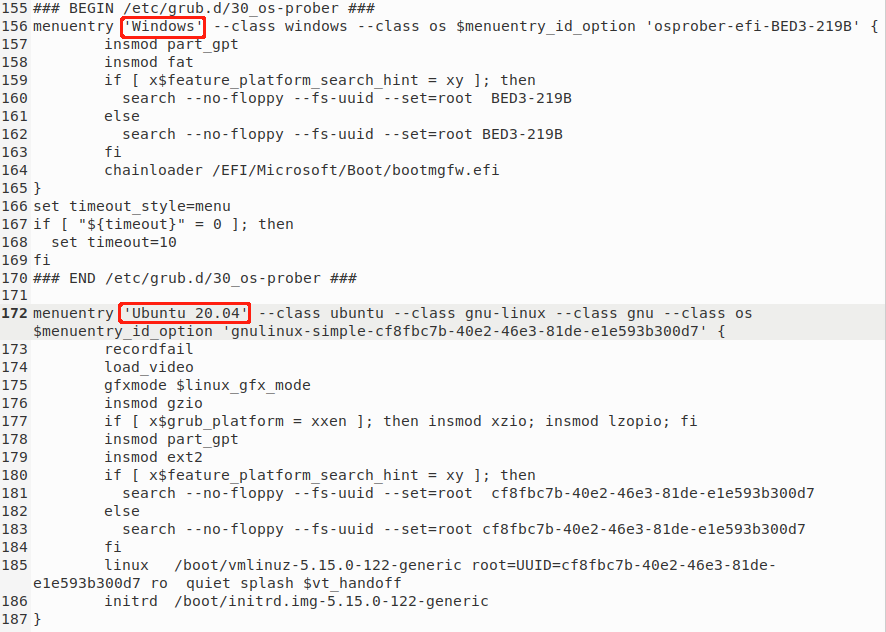

# 双系统相关

## Windows和Ubuntu双系统更改开机默认启动顺序

!!!bug Attention 
    如果是联想拯救者，请不要插着PD快充开机，否则会导致cfg文件重置 

### 1.打开终端进入/boot/grub/目录

`cd /boot/grub`

### 2.编辑grub.cfg文件

`sudo gedit grub.cfg`输入电脑密码开始编辑

!!!note 备份文件
    如果担心编辑出错，可以先保存文件再编辑 
    `mv grub.cfg grub.cfg.back`  

### 3.找到windows的位置

### 4.粘贴到ubuntu之前

### 5.保存，重启

### 6.美化措施

可以自行命名，修改结果会在boot界面显示

## 如何删除双系统下在windows EFI里的ubuntu信息 

需要删除三个部分

### 数据文件存放位置

直接删除卷即可出现上图的情况

### efi分区系统

安装双系统时，在windows的efi里有注册信息，因此需要删除其中的ubuntu信息

选择进去EFI所在的磁盘后，通过assign letter = p把EFI分区挂载到p盘里

此时可以看到文件管理器里有一个新的P盘，但是无法直接访问，因此这里用管理员权限打开记事本，然后访问P盘，直接删除ubuntu选项即可

最后，取消挂载即可

